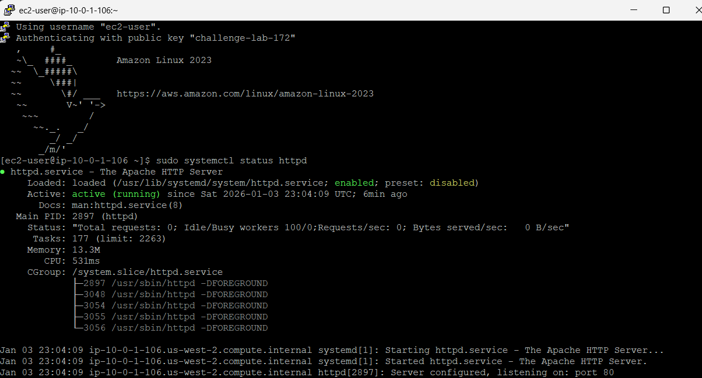
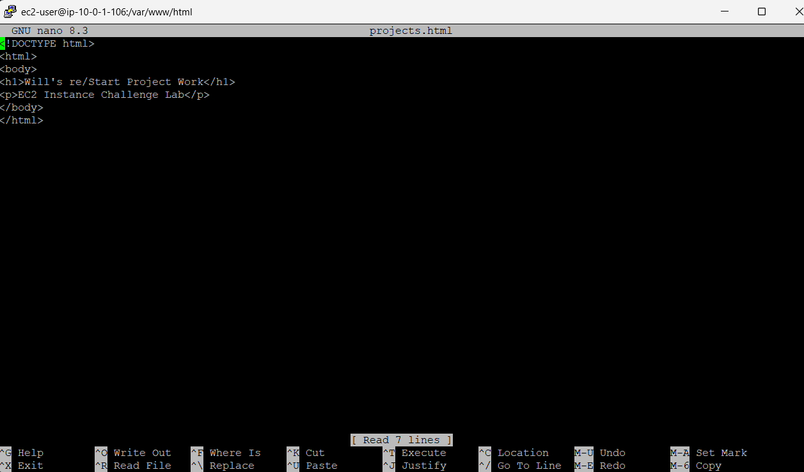
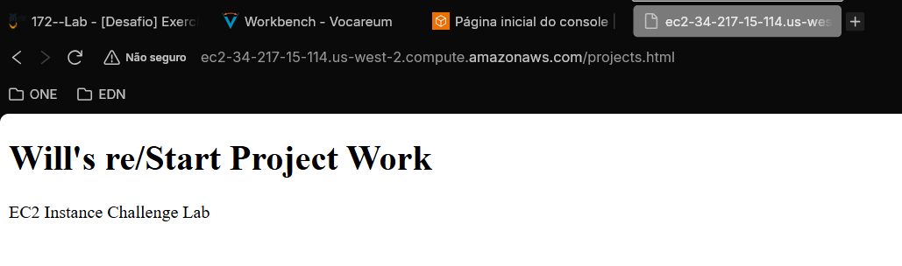
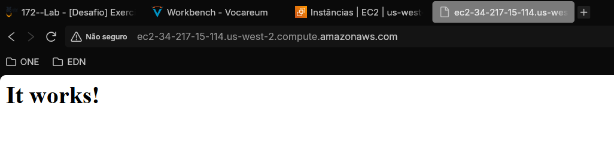

# 🧪 Desafio Exercício de EC2 e VPC

## 🔍 Visão Geral

- *Data:* 03/01/2026
- *Nome do Lab:* 172--Lab - Desafio Exercício de instância do EC2
- *Plataformas*: AWS re/start (Canvas) 
- *Serviços AWS:*  EC2, VPC
- *Objetivo:* 
	-  Configurar uma rede virtual.
	- Colocar uma instância do Amazon Linux Amazon Linux EC2 nessa rede virtual.
	- Instalar um servidor web e implantar e executar uma aplicação simples nele.

---

## 🧩 Problema a Ser Resolvido

- Em muitas empresas, é comum a necessidade de criar rapidamente servidores na nuvem para hospedar aplicações web, sem depender de infraestrutura física. No cenário real, isso envolve configurar redes, definir subnets, criar instâncias de forma segura e garantir que o serviço esteja disponível para os usuários. 

- Este desafio simula exatamente essa situação, permitindo vivenciar o processo de criação de uma instância Amazon EC2, configure um servidor web e publique uma página, enfrentando de forma prática os mesmos obstáculos que profissionais encontrariam em um ambiente de nuvem corporativo.

---

## 🏗️ Arquitetura da Solução

### Descrição da Arquitetura

A solução consiste nos seguintes passos:

1. **Criação da infraestrutura de rede**
    - Criar uma **VPC** com subnets públicas e privadas.
    - Criar um **Security Group** para permitir acesso **SSH (porta 22)** e **HTTP (porta 80)**.

2. **Lançamento da instância EC2**
    - Utilizar uma **Amazon Linux AMI**.
    - Associar a instância à **VPC criada** e ao **Security Group**.
    - Configurar a instância para receber um **endereço IPv4 público**.

3. **Configuração do servidor web**
    - Incluir um **script de user data** durante o lançamento para:
        - Instalar e iniciar o serviço **httpd**.
        - Configurar a pasta `/var/www/html` com permissões de escrita.

4. **Deploy e teste da aplicação**
    - Conectar à instância usando **EC2 Instance Connect**.
    - Criar e copiar uma página HTML de teste para `/var/www/html`.
    - Acessar o conteúdo pelo navegador para **validar o funcionamento do servidor**.

---
## 🧰 Serviços Utilizados e Justificativa

### Serviço AWS #1 Amazon EC2
- **Função:** Hospedar e executar a aplicação web em uma instância virtual na nuvem.

- **Por que foi escolhido:** Permite criar rapidamente servidores escaláveis e configuráveis, compatíveis com Amazon Linux AMI e scripts de inicialização (user data).

- **Benefício principal:** Fornece flexibilidade para instalar e gerenciar software, além de disponibilizar IP público para acesso externo de forma segura e prática.

### Serviço AWS #2 Amazon VPC
- **Função:** Criar a rede virtual onde a instância EC2 será lançada, incluindo subnets públicas e privadas, roteamento e segurança.

- **Por que foi escolhido:** Permite isolar recursos em uma rede própria, controlar endereçamento IP e definir regras de acesso via security groups e route tables.

- **Benefício principal:** Garante que a infraestrutura tenha **segurança e organização**, além de fornecer conectividade pública ou privada conforme necessário.

---

## 🪜 Passo a Passo 

1. Criar uma VPC 
	- Associar as subnets;
	- Garantir associação das tabelas de rota para o Internet Gateway;

2. Criar o Security Group:
	- Definir regra de entrada para SSH e HTTP;

3. Criar a instância EC2:
	- Definir AMI, Volume, Tipo;
	- Associar ao SG e a VPC criados;
	- Adicionar script no user data para baixar Apache e dar permissões necessárias
	```bash
	#!/bin/bash
	# Atualiza os pacotes do sistema
	yum update -y
	
	# Instala o Apache (httpd)
	yum install -y httpd
	
	# Inicia o serviço do Apache
	systemctl start httpd
	systemctl enable httpd
	
	# Define o usuário proprietário do diretório como ec2-user
	chown ec2-user:ec2-user /var/www/html
	
	# Dá permissão de escrita apenas para o dono, leitura e execução para todos
	chmod 755 /var/www/html

	```

4. Verificar se o serviço HTTPD realmente foi instalado e está em execução:
	- Acessar via ``SSH`` ou ``EC2 Instance Connect``
	- Executar `sudo systemctl status httpd`
	

5.  Criar a página para ser exibida na WEB
	- Naveguei até ``/var/www/html`` 
	- Abri o nano e escrevi o seguinte código HTML:
		```html
		<!DOCTYPE html>
		<html>
			<body>
				<h1>YOUR-NAME's re/Start Project Work</h1>
				<p>EC2 Instance Challenge Lab</p>
			</body>
		</html>
		```
		
	

6. Conferindo a página via web
	

7. Lembrar:
	- Ao acessar sua instância no navegador, use ``HTTP://``
	- Adicionar no fim da ``URL`` o nome do seu arquivo `HTML`, nesse caso `/projects.html`
	- Sem adicionar o caminho correto, será exibido apenas o página padrão do Apache
		
---

## 🔐 Segurança

- O **Security Group** controla o acesso à instância, permitindo apenas **SSH (porta 22)** e **HTTP (porta 80)** de fontes autorizadas.

- A instância EC2 é lançada dentro de uma **VPC isolada**, com subnets públicas e privadas, garantindo que os recursos internos fiquem protegidos de acesso externo direto.

- O uso de **IAM roles e políticas** (quando aplicável) permite gerenciar permissões de forma segura, sem precisar armazenar credenciais diretamente na instância.

---

## 💰 Custos

- O custo principal é a execução da **instância EC2**, que depende do tipo (por exemplo, **t3.micro**) e do tempo que a instância fica ligada.

- O armazenamento do **volume EBS (gp2)** gera custo adicional conforme a quantidade de gigabytes provisionada.

- O tráfego de **dados para fora da AWS (Internet)** também pode gerar custos, enquanto o tráfego interno na mesma região geralmente é gratuito.

---
