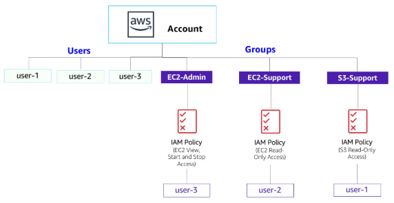
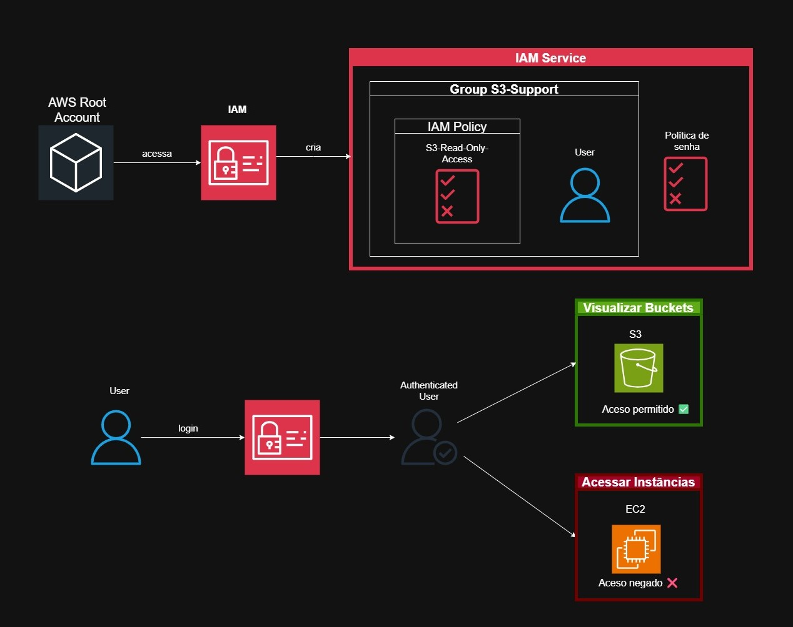
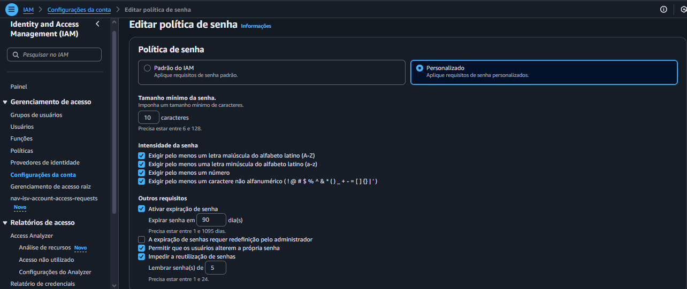
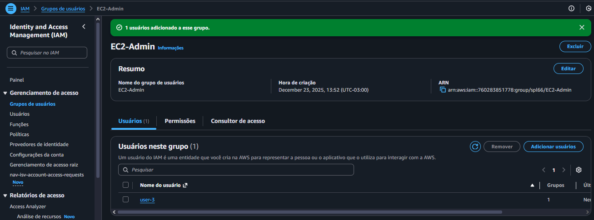
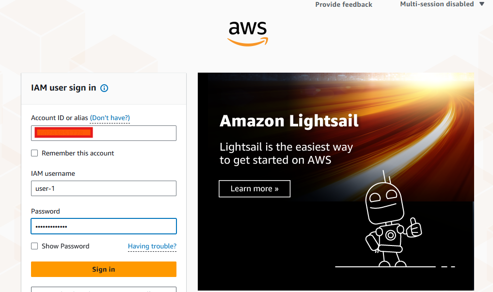
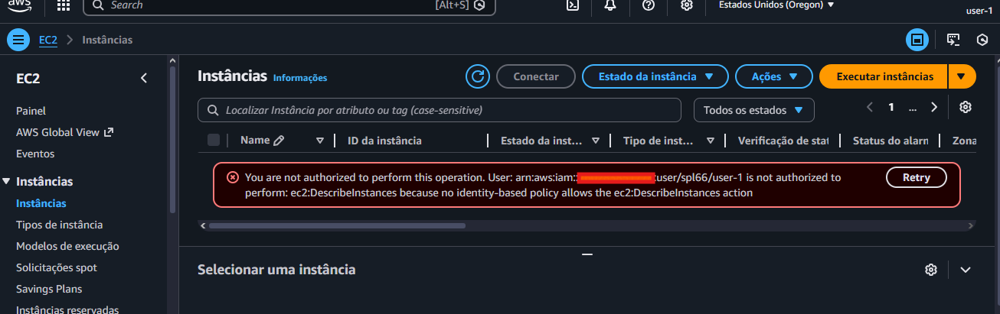

# 🧪 Introdução ao gerenciamento de Identidade e Acesso 

## 🔍 Visão Geral

- *Data:* 25/11/2025
- *Nome do Lab:* 279--Lab - Introdução ao gerenciamento de identidade e acesso (IAM)
- *Plataformas*: AWS re/start (Canvas) 
- *Serviços AWS:*  IAM
- *Objetivos:* 
	- Criar e aplicar uma política de senhas do IAM
	- Explorar os usuários e grupos de usuários pré-criados do IAM
	- Inspecionar as políticas do IAM aplicadas aos grupos de usuários pré-criados
	- Adicionar usuários a grupos com capacidades específicas ativas
	- Localizar e usar o URL de login do IAM
	- Testar os efeitos das políticas sobre o acesso ao serviço

---
## 🧩 Problema a Ser Resolvido

Em muitos ambientes corporativos, um único login pode conceder acesso a diversos recursos do sistema, como servidores, pastas compartilhadas, intranet da empresa, impressoras e outros dispositivos de rede.  
Quando o controle de acesso e os mecanismos de autenticação não são configurados corretamente, usuários não autorizados podem explorar esses recursos facilmente, causando riscos de segurança, vazamento de dados e acessos indevidos.

---
## 🏗️ Arquitetura da Solução

### Descrição da Arquitetura

- A solução utiliza o **AWS Identity and Access Management (IAM)** como camada central de controle de acesso.

- Os usuários não acessam os serviços da AWS diretamente com permissões individuais; em vez disso, eles são **associados a grupos**, e os **grupos possuem políticas IAM** que definem o que pode ou não ser feito.

- O fluxo funciona da seguinte forma:
	-  **Política de senha** é configurada no nível da conta para garantir autenticação segura para todos os usuários.
    
	- **Usuários IAM** são criados para representar pessoas da organização.
    
	- **Grupos IAM** são definidos de acordo com funções de trabalho (ex.: suporte S3, suporte EC2, administrador EC2).
    
	- **Políticas IAM** são associadas aos grupos, concedendo permissões específicas (somente leitura ou administração).
    
	- **Usuários são adicionados aos grupos** e passam a herdar automaticamente as permissões correspondentes.
    
	- Quando um usuário faz login pelo **URL de login do IAM**, o acesso aos serviços da AWS (S3 ou EC2) é permitido ou negado conforme as políticas do grupo ao qual ele pertence.

- Essa arquitetura garante **controle centralizado de acesso**, **segurança**, **princípio do menor privilégio** e **facilidade de gerenciamento**, pois permissões são mantidas nos grupos e não diretamente nos usuários.

---

### 🖼️ Diagrama de Arquitetura

- Diagrama base - *AWS re / start (Canvas)*

- Diagrama do fluxo estudado

---

## 🧰 Serviços Utilizados e Justificativa

### Serviço AWS #1 - **AWS Identity and Access Management (IAM)**
- Função: Gerenciar identidades, autenticação e permissões de acesso aos recursos da AWS;
- Por que foi escolhido: Por ser o serviço base de segurança da AWS;
- Benefício principal:  Evitar acessos não autorizados e permitir controle granular;

---

## 🪜 Passo a Passo 
1. Acessei o console de gerenciamento da AWS e busquei pelo serviço de IAM;
2. Acessei as configurações de conta de editei a política de senha; 

3. Acessei os grupos de usuários criados e associei cada um em seu grupo

4.  Fiz login e testei os usuários

- Usuário 01 tem acesso ao recursos de S3

- Usuário 01 tem acesso negado a recursos de EC2

---

## 🔐 Segurança

- Uso de **políticas IAM** para limitar ações permitidas, garantindo que usuários tenham apenas as permissões necessárias.

- Organização de usuários em **grupos IAM**, facilitando a aplicação consistente de permissões por função de trabalho.

- Aplicação de **política de senha forte** no nível da conta, reduzindo riscos de acesso indevido por credenciais fracas.

---

## 💰 Custos

- O **AWS IAM não possui custo adicional**, sendo um serviço gratuito da AWS.

- Os custos da solução estão relacionados apenas aos **serviços acessados pelos usuários** (ex.: EC2, S3), conforme suas permissões.

- O uso adequado do IAM ajuda a **evitar custos desnecessários**, impedindo que usuários criem ou modifiquem recursos sem autorização.

---
