# 🧪 Criar um site no S3

## 🔍 Visão Geral

- *Data:* 05/12/2025
- *Nome do Lab:* 170--Lab - Criar um site no S3
- *Plataformas*: *AWS re/start (Canvas) 
- *Serviços AWS:*  S3
- *Objetivo:*
	-  Executar comandos da AWS CLI que usam os serviços do IAM e do Amazon S3.
	- Implantar um site estático em um bucket do S3.
	- Criar um script que use a AWS CLI para copiar arquivos de um diretório local para o Amazon S3.

---

## 🧩 Problema a Ser Resolvido

Atualmente, a cafeteria e padaria não possuem um site disponível online para apresentar seus produtos e serviços. O objetivo é disponibilizar rapidamente um site estático acessível ao público, utilizando a infraestrutura da AWS, sem a necessidade de configurar servidores web complexos. Além disso, é necessário criar uma forma eficiente de atualizar o site sempre que houver alterações no conteúdo local, garantindo que o site online esteja sempre atualizado.

Problemas específicos que o laboratório resolve:

1. **Hospedagem de site estático de forma rápida e escalável** sem precisar configurar servidores web tradicionais.

2. **Gerenciamento de arquivos e permissões** para garantir que o conteúdo do site esteja acessível ao público.

3. **Automatização da atualização do site**, permitindo que modificações locais sejam refletidas no site online de forma prática e repetível.

---

## 🏗️ Arquitetura da Solução

### Descrição da Arquitetura

A solução utiliza a **infraestrutura da AWS** para hospedar e gerenciar um site estático da cafeteria e padaria de forma simples e escalável:

1. **Amazon S3**: Armazena os arquivos do site (HTML, CSS, imagens) em um bucket configurado para **hospedagem de site estático**. O bucket é configurado com acesso público para permitir que qualquer usuário acesse o site via navegador.

2. **AWS CLI na instância EC2**: Permite enviar e atualizar os arquivos do site no bucket de forma automatizada, usando comandos como `aws s3 cp` ou `aws s3 sync`.

3. **Amazon EC2 (Amazon Linux)**: Servidor usado apenas para executar a AWS CLI e gerenciar os arquivos do site localmente. A conexão é feita via **Session Manager do AWS Systems Manager** sem necessidade de SSH direto.

4. **AWS IAM**: Criação de um usuário com políticas que concedem **acesso total ao S3**, permitindo gerenciar o conteúdo do bucket de forma segura.

5. **Script de atualização**: Um arquivo de lote (`update-website.sh`) automatiza o envio de arquivos modificados para o bucket, garantindo que o site esteja sempre atualizado sem precisar executar comandos manualmente.

O fluxo funciona assim: o conteúdo do site é desenvolvido ou atualizado localmente → o script envia os arquivos para o bucket do S3 → o bucket publica os arquivos via **endpoint público** do S3, disponibilizando o site online.

---

### Diagrama de Arquitetura

- Diagrama lab AWS re start
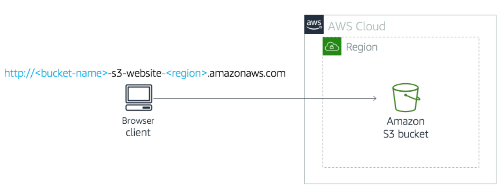

- Diagrama de estudo
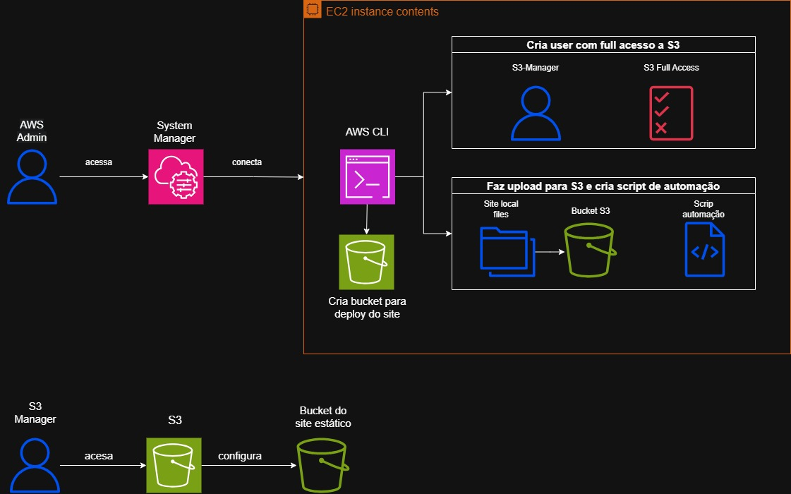
---

## 🧰 Serviços Utilizados e Justificativa

### Serviço AWS #1 Amazon S3
- **Função:** Armazenar e hospedar os arquivos do site estático (HTML, CSS, imagens) e fornecer um endpoint público para acesso via navegador.

- **Por que foi escolhido:** O Amazon S3 é ideal para hospedar sites estáticos porque não requer configuração de servidor web, é altamente escalável e seguro.

- **Benefício principal:** Permite disponibilizar o site da cafeteria e padaria de forma rápida, confiável e com alta disponibilidade, sem custos de gerenciamento de servidor.
### Serviço AWS #2 IAM
- **Função:** Gerenciar usuários, permissões e políticas de acesso ao bucket do S3, garantindo que apenas usuários autorizados possam modificar o conteúdo do site.

- **Por que foi escolhido:** O IAM permite criar usuários específicos com políticas de acesso granular, garantindo segurança e controle sobre quem pode gerenciar os arquivos do site.

- **Benefício principal:** Aumenta a segurança da solução, permitindo controle de acesso detalhado e evitando alterações não autorizadas no site.

---

## 🪜 Passo a Passo 

1.  Fiz a conexão a Instância do EC2, usei o Session Manager do AWS Systems Manager;

2.  Com a instância pronta, configurei a AWS CLI para gerenciar serviços como **S3** e **IAM** diretamente do terminal da instância;

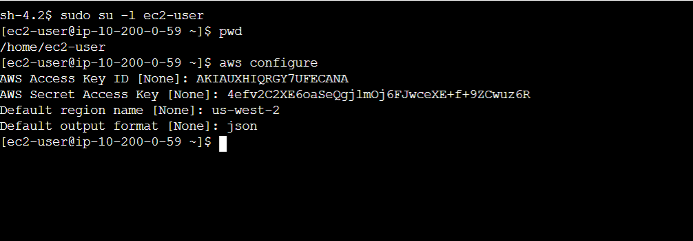

3.  Criei um bucket do S3 usando a AWS CLI;

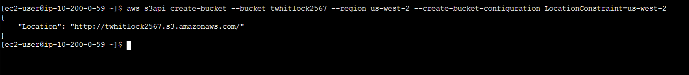

4. Criei um usuário IAM usando a AWS CLI;

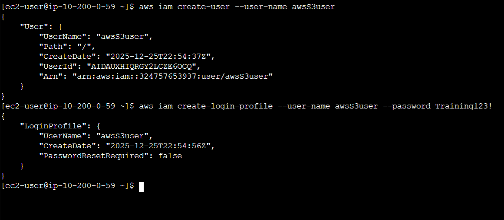

5. Conferi as políticas referentes a S3

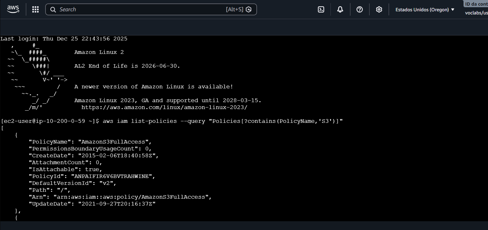

6. Dei permissão para o novo user ter acesso ao S3

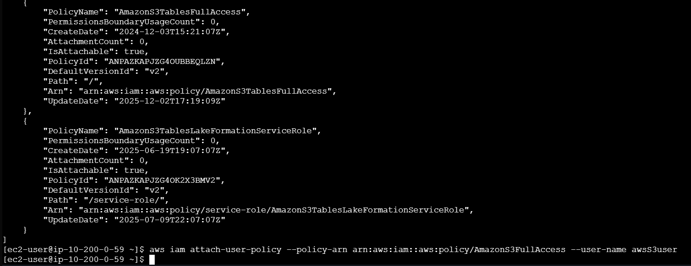

7. Conectar a console com esse novo user

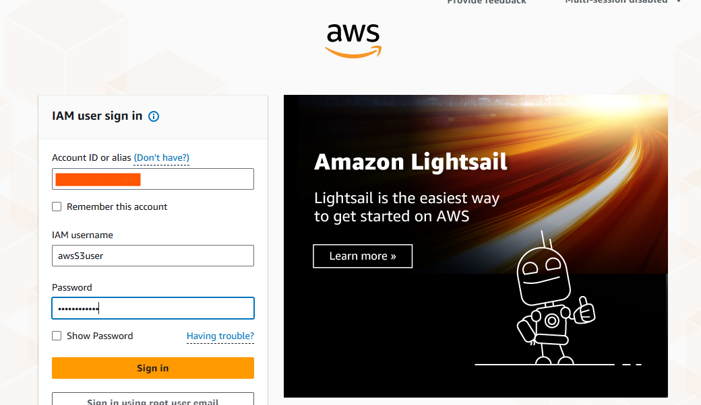

8. Permitir que o bucket seja acessado pelo público

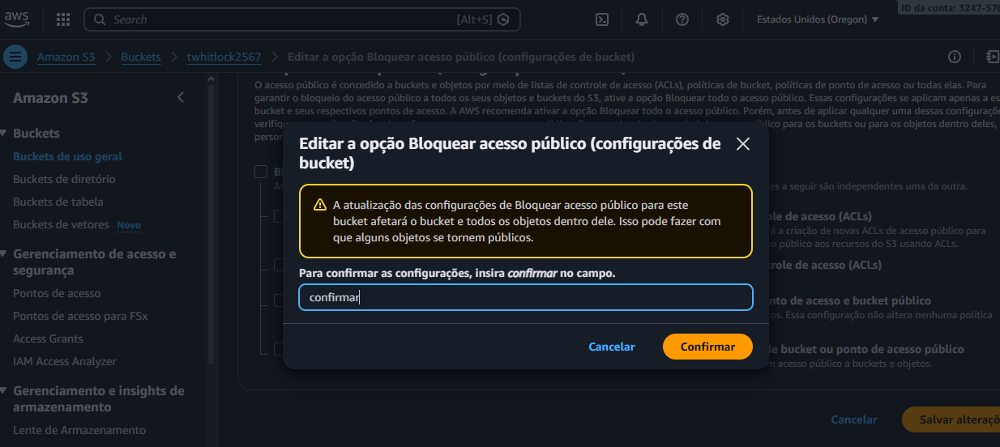

9. Extrair os arquivos do site pelo AWS CLI

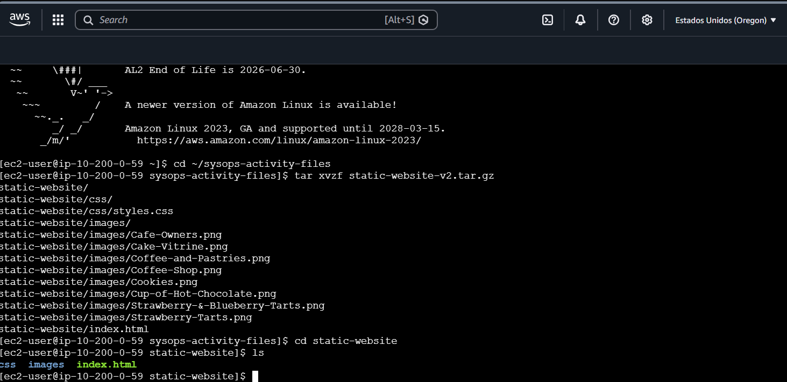

10. Fiz o upload dos arquivos do site da EC2 para o bucket S3

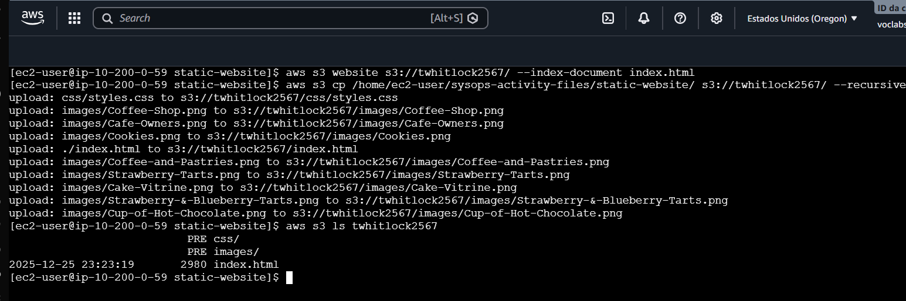

11. Visualizar o site hospedado

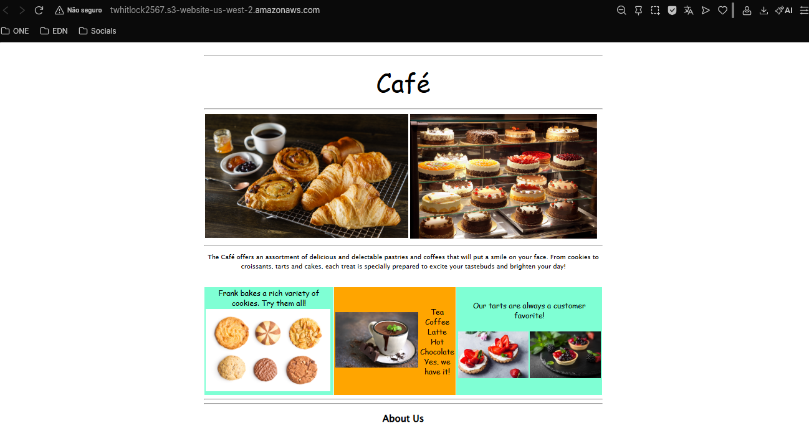

12. Criando arquivo em lote para tornar a atualização do site repetível

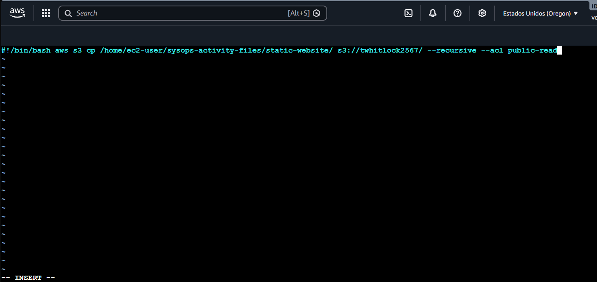

13. Deixando o scrip executável

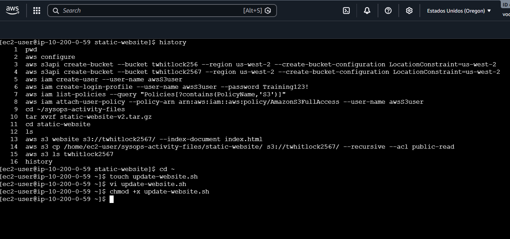

14. Alterei o HTML do site local e subi as mudanças para o S3 via script criado

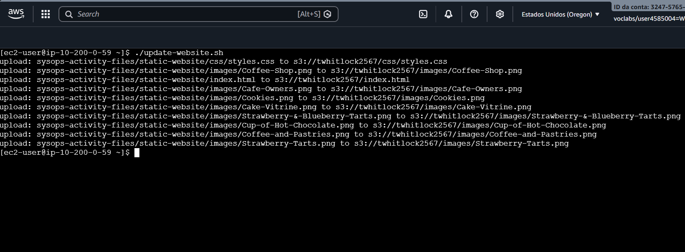

15. Site com cores alteradas como demonstração

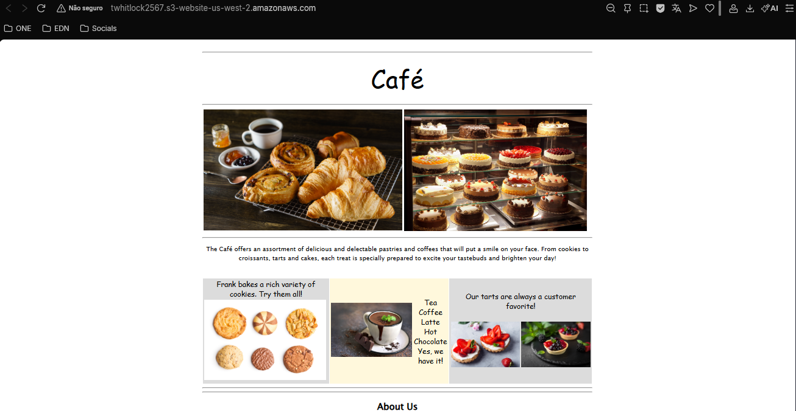

---

## 🔐 Segurança

- **Controle de acesso com IAM:** Apenas usuários autorizados (como `awsS3user`) podem modificar os arquivos do bucket, evitando alterações não autorizadas.

- **Políticas de bucket e ACLs:** Configurações de acesso público e ACLs garantem que os arquivos do site sejam acessíveis ao público, mas somente leitura, mantendo a integridade dos dados.

- **Conexão segura via Session Manager:** O acesso à instância EC2 é feito sem SSH direto, usando o AWS Systems Manager, o que elimina a necessidade de abrir portas e reduz riscos de intrusão.

---

## 💰 Custos
> Quanto a solução pode custar e quais fatores influenciam o preço.

- **Armazenamento S3:** O custo depende do volume de dados armazenados e do número de requisições de leitura/escrita realizadas no bucket. Para sites estáticos pequenos, o custo é geralmente muito baixo.

- **Transferência de dados:** O tráfego de saída (download do site pelos usuários) pode gerar custos, especialmente se houver muitas visitas.

- **EC2 e Session Manager:** A instância EC2 usada para gerenciar os arquivos tem custo apenas enquanto estiver em execução. O uso do Session Manager não gera custo adicional.

---
