# 🧪 Criando instâncias do Amazon EC2

## 🔍 Visão Geral

- *Data:* 05/12/2025
- *Nome do Lab:* 171--Lab - Criando instâncias do Amazon EC2
- *Plataforma*: AWS re/start (Canvas)
- *Serviços AWS:*  EC2
- *Objetivo:* 
	- Executar uma instância do EC2 usando o Console de Gerenciamento da AWS.
	- Conectar-se à instância do EC2 usando o EC2 Instance Connect.
	- Iniciar uma instância do EC2 usando a AWS CLI.

---

## 🧩 Problema a Ser Resolvido

Uma equipe de tecnologia precisa disponibilizar rapidamente servidores na nuvem para testes e aprendizado, garantindo acesso seguro e a possibilidade de automação. O desafio é criar uma infraestrutura básica na AWS que permita o acesso administrativo controlado a instâncias e, a partir desse acesso, provisionar novos servidores de forma automatizada.

Para isso, é necessário:

- Criar uma instância inicial que funcione como **host bastion**, servindo como ponto de acesso seguro à infraestrutura.

- Utilizar esse host para **interagir com a AWS via linha de comando (AWS CLI)**.

- Provisionar uma segunda instância que funcione como **servidor web**, configurada automaticamente no momento da inicialização.

- Garantir que a comunicação de rede e as permissões estejam corretamente configuradas para permitir acesso SSH e HTTP de forma segura.

Esse cenário simula uma situação real de uso da AWS, onde o console é usado para tarefas pontuais e a automação é utilizada para criar recursos de forma repetível e confiável.

---

## 🏗️ Arquitetura da Solução

### Descrição da Arquitetura

A solução consiste em duas instâncias do Amazon EC2 dentro de uma VPC pública:

1. **Host Bastion**:
    - Instância inicial que serve como ponto de acesso seguro.
    - Permite conexões SSH usando EC2 Instance Connect.
    - Atua como gateway para provisionar e gerenciar outras instâncias via AWS CLI.

2. **Servidor Web**:
    - Instância provisionada a partir do host bastion.
    - Configurada automaticamente com um servidor web Apache usando **dados do usuário (user data)**.
    - Exposta à internet via um **grupo de segurança HTTP**.

**Fluxo da solução**:

1. Usuário acessa o host bastion via EC2 Instance Connect.
2. Pelo bastion, comandos da AWS CLI são executados para criar a instância do servidor web.
3. O servidor web inicializa e executa um script de dados do usuário, instalando o Apache e o aplicativo web.
4. O servidor web fica acessível publicamente via seu DNS público.

Essa arquitetura garante **acesso seguro, automação e separação de funções**, simulando um ambiente de produção básico.

---

### Diagrama de Arquitetura

- Diagrama: AWS re / start:

	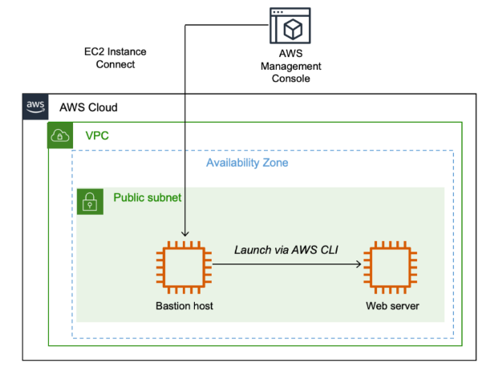

- Diagram desenvolvido com os estudos da arquitetura:
	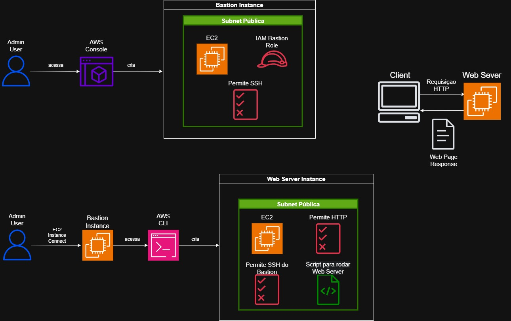
---

## 🧰 Serviços Utilizados e Justificativa

### Serviço AWS #1 Amazon EC2

- **Função:** Prover instâncias de computação na nuvem para o host bastion e o servidor web.

- **Por que foi escolhido:** Permite criar servidores sob demanda com flexibilidade de configuração, podendo ser gerenciados pelo console ou pela AWS CLI.

- **Benefício principal:** Oferece escalabilidade, acesso seguro e automação na criação e gerenciamento de servidores.

### Serviço AWS #2 AWS CLI

- **Função:** Permitir interação programática com a AWS, incluindo a criação e configuração de instâncias EC2.

- **Por que foi escolhido:** Facilita a automação do provisionamento de recursos, garantindo consistência e repetibilidade na criação de instâncias.

- **Benefício principal:** Reduz erros manuais e permite criar scripts para gerenciar a infraestrutura de forma rápida e confiável.

---

## 🪜 Passo a Passo

1. **Criar a instância Bastion Host pelo Console da AWS**
    - **Definir nome e tags:** adicionamos a tag `Name = Bastion Host` para identificar facilmente a instância.
    
    - **Escolher AMI (Amazon Machine Image):** selecionamos o Amazon Linux 2, que fornece o sistema operacional e pacotes básicos necessários.
    
    - **Selecionar tipo de instância:** escolhemos `t3.micro`, definindo CPU, memória, desempenho de rede e armazenamento associados.
    
    - **Configurar par de chaves:** neste lab, não é necessário criar chaves, pois a conexão será feita via **EC2 Instance Connect** (não exige credenciais locais).
    
    - **Configurar rede:** a instância é lançada na **Lab VPC**, em uma sub-rede pública com **IP público automático** habilitado.
    
    - **Criar grupo de segurança:** `Bastion Security Group`, permitindo apenas tráfego **SSH (porta 22)** para acesso seguro ao host.
    
    - **Associar IAM Role:** usamos o **Bastion-Role**, que permite à instância executar comandos da AWS CLI e interagir com serviços da AWS, como criar a instância do servidor web.
	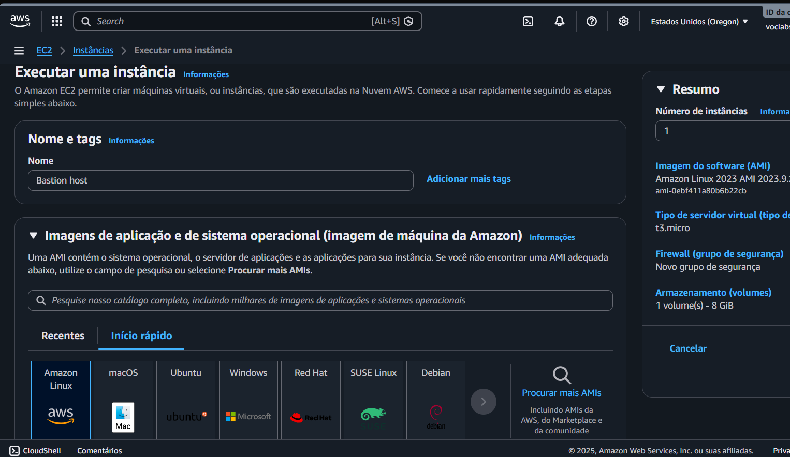

2. **Criar uma instância de EC2 usando AWS CLI**:
	- Conectamos no nosso Bastion Host via EC2 Instance Connect;
	- Por meio da CLI, usamos a instância que já temos rodando para obter a settar região, obter AMI, Subnet e Security Group 
	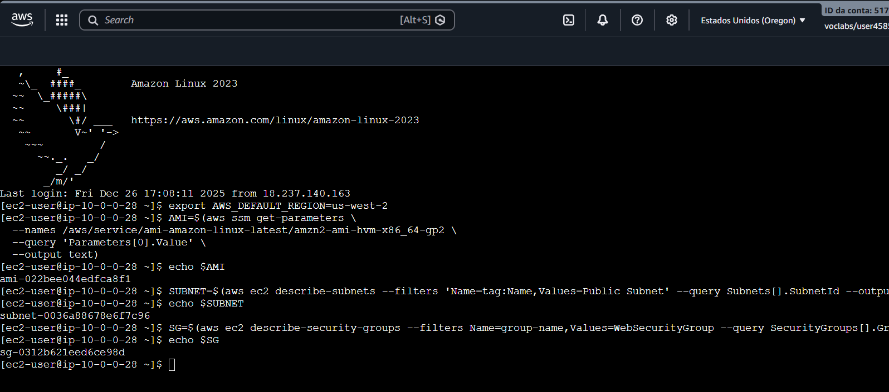

3. **Baixar o script que vai instalar o web server na instância e a aplicação web**
	- Apache Web Server e os arquivos do site 
	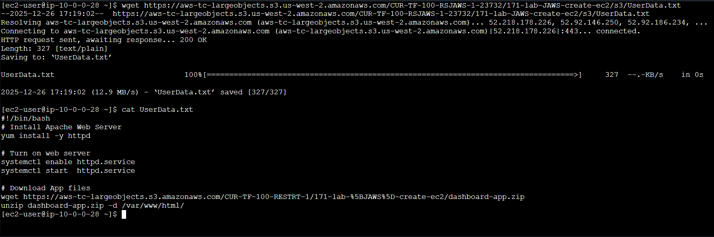

4. **Criamos a instância com os dados obtidos anteriormente**
	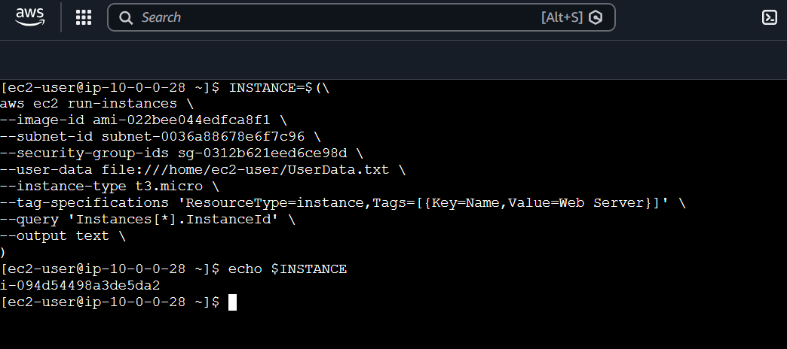

5. Podemos verificar se a instância foi criada e está executando pegando seu IP e acessando:
	

	- Também podemos conferir no console, mais aprensentável:
		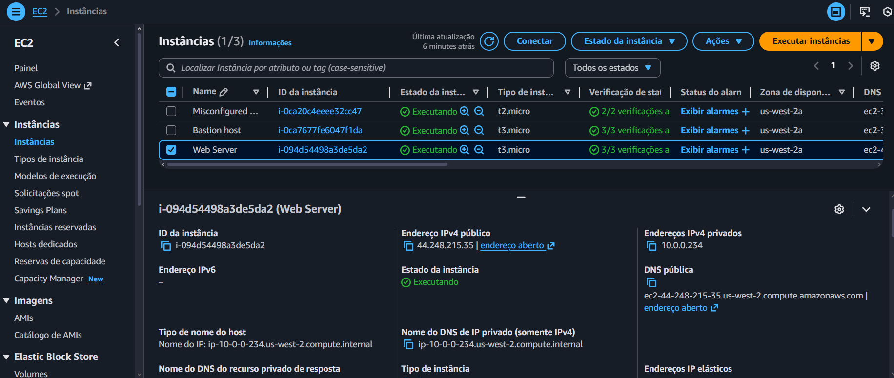

6. Aplicação Web Rodando na EC2
	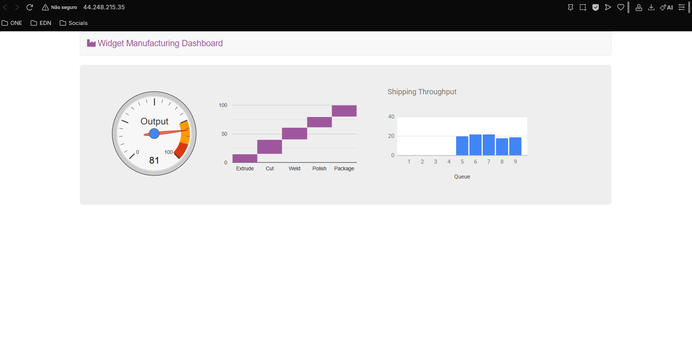

7. **Resolvendo desafios:**

	- **1º Desafio proposto pelo Lab:** Identificar o motivo de uma instância não aceitar o acesso via EC2 Instance Connect:
	
		- Foi resolvido, a porta 22 para SSH estava fechada, era necessário apenas editar o grupo de segurança, adicionando essa regra de entrada. ✅
			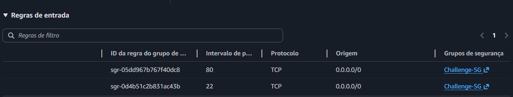

	- **2º Desafio proposto pelo Lab:**  Identificar o motivo da aplicação web não estar sendo acessada, temos connection time out ao tentar visualizar a página:
	
		- Foi resolvido, agora como é possível acessar a EC2 pela CLI, por ter  liberado a porta para conexão SSH, podemos ver o que está sendo executado, e assim descobrir que o Web Server estava inativo, era apenas ativar novamente. ✅
			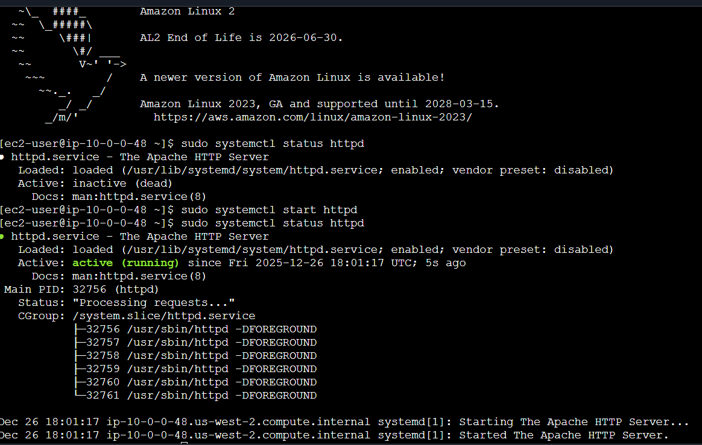

		- Web Application do desafio finalmente acessível ✅
			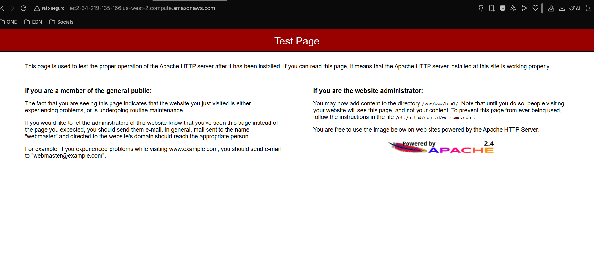

---

## 🔐 Segurança

- **Host Bastion como ponto de acesso seguro:** apenas ele possui acesso SSH direto à internet, reduzindo a superfície de ataque.

- **Grupos de segurança:** controlam rigorosamente o tráfego de entrada e saída para as instâncias, permitindo apenas conexões necessárias (SSH para bastion, HTTP para servidor web).

- **Uso de EC2 Instance Connect:** elimina a necessidade de gerenciar chaves privadas manualmente, oferecendo login temporário e seguro.

---

## 💰 Custos

- **Tipo de instância:** instâncias t3.micro são elegíveis para o nível gratuito da AWS, o que reduz ou elimina custos se dentro dos limites.

- **Tempo de execução das instâncias:** quanto mais tempo as instâncias ficarem ativas, maior será o custo.

- **Armazenamento EBS:** cada volume adicional e maior capacidade impacta o custo total.

- **Tráfego de dados:** transferências de dados entre regiões ou para fora da AWS podem gerar custos adicionais.

---
