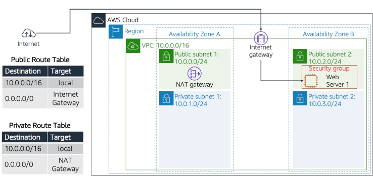
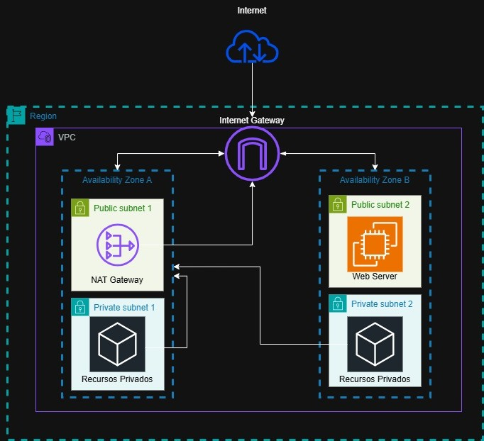
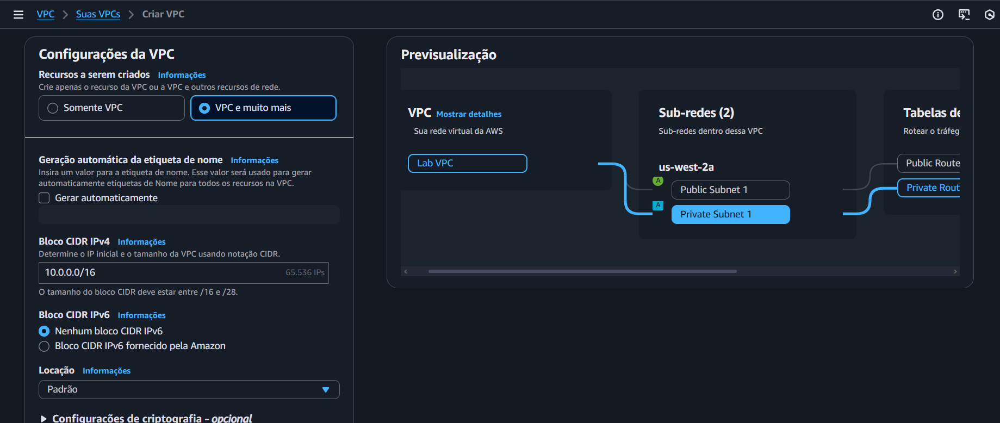
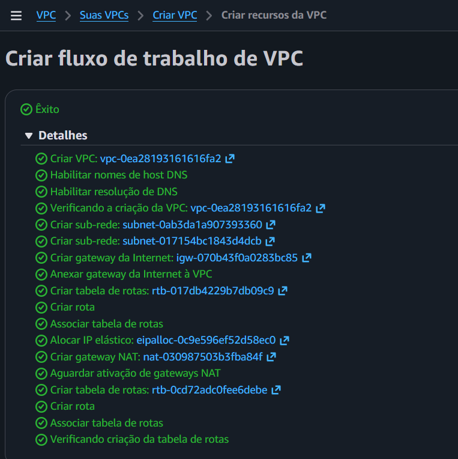
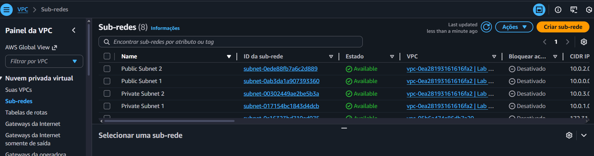
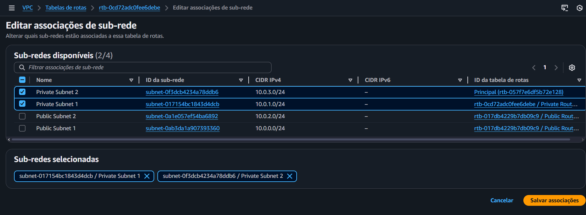
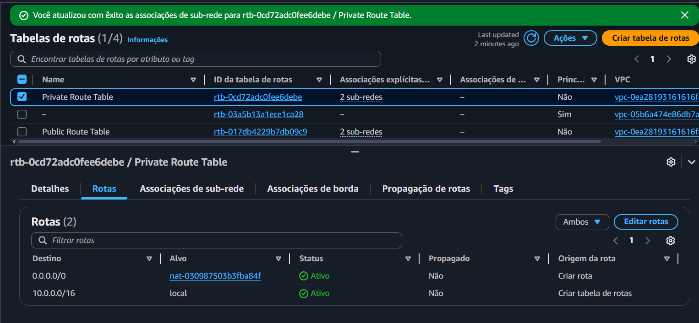
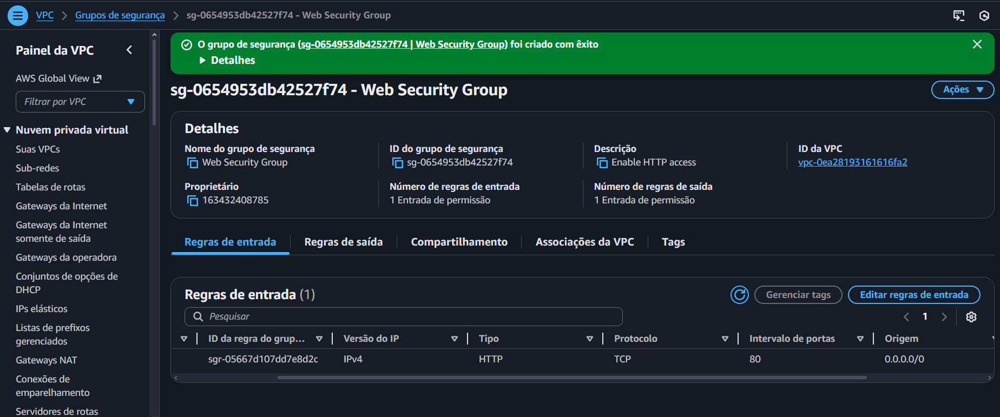
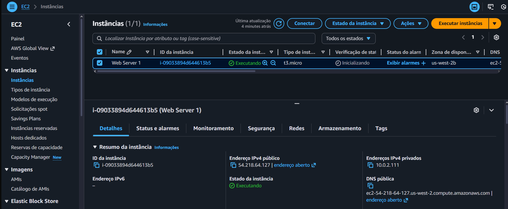

# 🧪 Criar VPC e iniciar um servidor Web

## 🔍 Visão Geral

- *Data:* 18/11/2025
- *Nome do Lab:* 267--Lab - Criar a sua VPC e iniciar um servidor Web
- *Plataformas*: AWS re/start (Canvas)
- *Serviços AWS:*  VPC
- *Objetivo:*
	- Criar uma nuvem privada virtual (VPC)
	- Criar sub-redes
	- Configurar um grupo de segurança
	- Iniciar uma instância de EC2 dentro da nova VPC

---

## 🧩 Problema a Ser Resolvido

- Um cliente precisa de uma **rede segura e organizada** na nuvem para hospedar um servidor web.

- A rede deve ter **subnets públicas para recursos acessíveis pela internet** e **subnets privadas para recursos internos**, garantindo isolamento e segurança.

- É necessário que os recursos privados consigam **acessar a internet para atualizações ou downloads**, sem serem expostos.

- O cliente também precisa que o servidor web esteja protegido por **regras de firewall (Security Groups)** e que a infraestrutura seja configurável para **alta disponibilidade**.

- A tarefa é criar toda a VPC, configurar subnets, rotas, gateways e iniciar uma instância EC2 funcional que sirva um servidor web, garantindo que a arquitetura funcione corretamente

---

## 🏗️ Arquitetura da Solução

- **VPC** central (10.0.0.0/16) como rede isolada na AWS.

- **Subnets públicas**: EC2 que serve o servidor web e acesso direto à internet via **Internet Gateway (IGW)**.

- **Subnets privadas**: recursos internos que acessam a internet apenas via **NAT Gateway**.

- **Route Tables**: definem o caminho do tráfego
    - Subnets públicas → rota 0.0.0.0/0 → IGW
    - Subnets privadas → rota 0.0.0.0/0 → NAT Gateway

- **Security Group**: firewall virtual permitindo HTTP para a instância pública.

- **EC2**: instância na subnet pública, com IP público, rodando servidor web Apache + PHP.

- Fluxo do tráfego:
    1. Usuário externo acessa o servidor web na subnet pública
    2. Instâncias privadas podem fazer requisições outbound via NAT, mas não recebem tráfego inbound direto
    3. Todas as subnets estão associadas às Route Tables corretas para garantir roteamento adequado


---

### Diagrama de Arquitetura

- Diagrama AWS re / start
	

- Diagrama do estudo da arquitetura
	
---

## 🧰 Serviços Utilizados e Justificativa

### Serviço AWS #1 - Amazon VPC
- **Função:** Criar uma rede virtual isolada na AWS, permitindo organizar subnets, controlar roteamento e segurança de recursos.

- **Por que foi escolhido:** Fundamental para toda a arquitetura de rede; todos os recursos (EC2, SGs, NAT, IGW) dependem da VPC.

- **Benefício principal:** Permite **controle total da rede**, isolamento seguro e escalabilidade da infraestrutura na nuvem.

### Serviço AWS #2 - Amazon EC2
- **Função:** Hospedar a aplicação (servidor web Apache + PHP) dentro da VPC.

- **Por que foi escolhido:** Necessário para executar o servidor web e testar o tráfego de rede entre subnets públicas e privadas.

- **Benefício principal:** Permite **execução de recursos computacionais personalizáveis** e conectados à rede criada, servindo conteúdo via HTTP.


---

## 🪜 Passo a Passo

1. Criar a VPC
	- No console da AWS e acessei o serviço de VPC.
	- Usei o assistente para criar uma **VPC nova**.
	- Adicionei **uma subnet pública e uma subnet privada**.
	- Criei um **Internet Gateway** para permitir acesso à internet da subnet pública.
	- Configurei um **NAT Gateway** para que a subnet privada pudesse acessar a internet sem receber tráfego externo.
    
	- Criei **duas Route Tables**:
    
		    - Uma apontando para o IGW (para a subnet pública)
        
		    - Outra apontando para o NAT Gateway (para a subnet privada)
        
	- Associei cada subnet à sua respectiva Route Table.
	- Verifiquei no painel que todos os recursos estavam criados e conectados corretamente.

	

		
	

2. Criar subnets adicionais
	- Criei **uma nova subnet pública** em outra zona de disponibilidade.
	- Criei **uma nova subnet privada** na mesma VPC, também em outra zona de disponibilidade.
    
	- Associei cada nova subnet à sua **Route Table correspondente**:
	    - Subnet pública → tabela de rota pública
	    - Subnet privada → tabela de rota privada
        
	- Conferi que as subnets adicionais estavam corretamente criadas e conectadas, mantendo a lógica de isolamento e acesso à internet.

	

3. Associar as subnets e adicionar rotas
	- Acessei a seção de **Route Tables** no console da VPC.
	- Seleciono a **tabela de rota pública** e associei as subnets públicas à tabela.
	- Seleciono a **tabela de rota privada** e associei as subnets privadas à tabela.
	- Verifiquei que todas as subnets estavam corretamente associadas às suas Route Tables, garantindo que o tráfego seguisse o caminho correto para internet ou NAT.
	
	

	

3. Criar grupo de segurança para permitir regra de entrada HTTP
	

4. Criar a instância EC2 para associar a esse grupo de segurança
	

---

## 🔐 Segurança

- **Security Groups** funcionam como firewall virtual, permitindo apenas tráfego HTTP para a instância EC2 pública.

- **Subnets privadas** isolam recursos internos, evitando exposição direta à internet; apenas saídas são permitidas via NAT Gateway.

- **Controle de roteamento** via Route Tables garante que tráfego indesejado não chega a recursos críticos, reforçando o isolamento da rede.

---

## 💰 Custos

- **EC2 t3.micro**: instância gratuita ou baixo custo para pequenos testes, mas aumenta com tempo de execução ou tipo maior de instância.

- **NAT Gateway**: cobrado por hora e por tráfego processado; subnets privadas usam para acessar internet.

- **Internet Gateway, VPC e Route Tables**: não têm custo direto, apenas recursos que trafegam ou instâncias que usam a rede.

---
## ⚙️ Observações do Ambiente

A instância está correta, com acesso à internet e permissões de Security Group adequadas. O único motivo pelo qual o lab não roda automaticamente é que o script original usa comandos obsoletos (`yum`, `chkconfig`) e não ajusta permissões ou `DirectoryIndex` do Apache. Tudo que é necessário é atualizar o script para `dnf`, `systemctl` e corrigir permissões — depois disso, a página do lab roda normalmente.

- Ao criar a instância no último passo para adicionar o scripy, não use o padrão, use esse:
```bash

#!/bin/bash
sudo dnf install -y httpd php unzip wget

wget https://aws-tc-largeobjects.s3.us-west-2.amazonaws.com/CUR-TF-100-RESTRT-1/267-lab-NF-build-vpc-web-server/s3/lab-app.zip

sudo unzip -o lab-app.zip -d /var/www/html/

sudo chown -R apache:apache /var/www/html/
sudo chmod -R 755 /var/www/html/

sudo sed -i 's/DirectoryIndex .*/DirectoryIndex index.php index.html/' /etc/httpd/conf/httpd.conf

sudo systemctl enable httpd
sudo systemctl restart httpd

```

---

### Caso já tenha feito com o script padrão e queria corrigir

1. Habilitar para que a instância aceite acesso SSH
	- Basta adicionar regra no SG

2. No Vocareum, acessar a aba de detalhes e fazer download da chave
	- Windows -> `.ppk`

3. No painel de EC2, selecionar instância e acessar a aba de conexão por SSH
	- Lá será possível obter o endereço do servidor que vamos acessar

4. No Putty
	- Em session adicionar o IP da instância
	- Em Auth -> Credentials -> Adicionar a chave baixada

5. Ao conectar, execute os seguintes comandos em ordem:

```bash

## Instalar pacotes necessários
sudo dnf install -y httpd php unzip wget


## Baixar os arquivos da página web
wget https://aws-tc-largeobjects.s3.us-west-2.amazonaws.com/CUR-TF-100-RESTRT-1/267-lab-NF-build-vpc-web-server/s3/lab-app.zip


## Descompactar na pasta do Apache
sudo unzip lab-app.zip -d /var/www/html/


## Ajustar as permissões do Apache
sudo chown -R apache:apache /var/www/html/
sudo chmod -R 755 /var/www/html/


## Configurar para iniciar o Apache
sudo systemctl enable httpd
sudo systemctl start httpd


## Teste para verificar o HTML da página inicial
curl localhost


```

6. Após isso, basta acessar o IP público da instância via HTTP no navegador