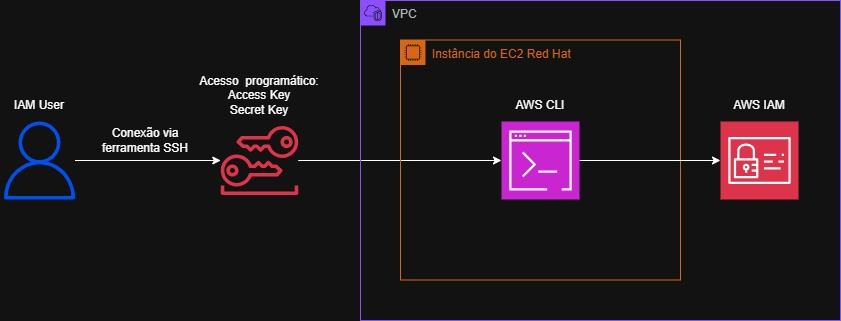
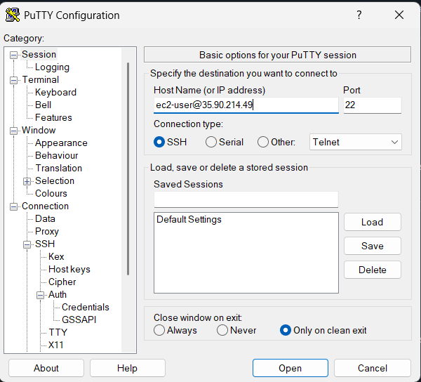
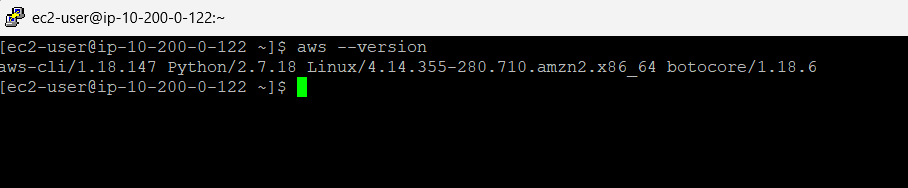
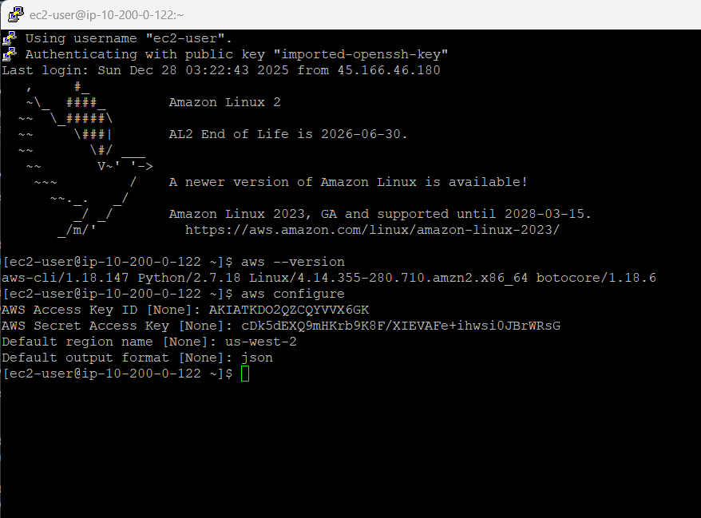
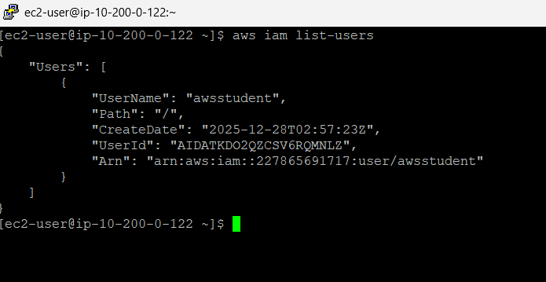
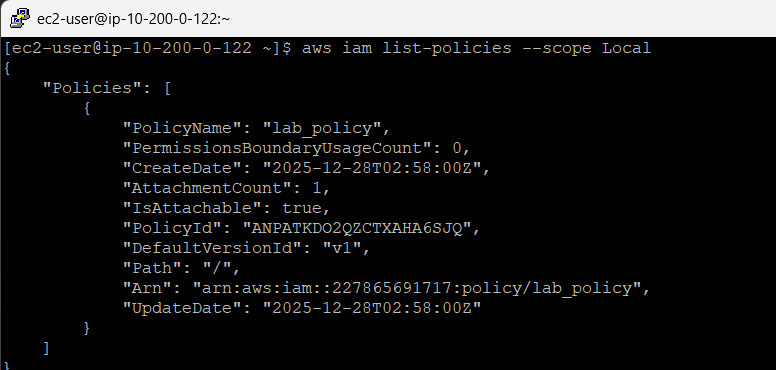

# 🧪  Instalar e configurar a CLI da AWS

## 🔍 Visão Geral

- *Data:* 02/12/2025
- *Nome do Lab:* 168--Lab - Instalar e configurar a CLI da AWS
- *Plataformas*: AWS re/start (Canvas) 
- *Serviços AWS:*  AWS CLI
- *Objetivo:* 
	- Instalar e configurar a AWS CLI.
	- Conectar a AWS CLI a uma conta AWS.
	- Acessar o IAM usando a AWS CLI.

---

## 🧩 Problema a Ser Resolvido

Em muitas empresas, gerenciar recursos de nuvem de forma manual pelo console da AWS pode ser lento e propenso a erros, especialmente quando há muitos usuários e políticas de acesso.  
O problema é a necessidade de automatizar e simplificar a administração da conta AWS, garantindo que usuários tenham permissões corretas e que seja possível interagir com serviços da AWS rapidamente.  
Neste laboratório, o objetivo é resolver esse problema instalando e configurando a AWS CLI em uma instância do EC2, permitindo a conexão à conta AWS, gerenciamento de usuários e políticas do IAM de forma segura e automatizada via linha de comando.

---

## 🏗️ Arquitetura da Solução

A solução utiliza uma instância do Amazon EC2 rodando Linux Red Hat dentro de uma VPC (Virtual Private Cloud). A AWS CLI é instalada na instância, permitindo que a máquina se conecte à conta AWS usando credenciais do IAM.  
A interação com os serviços da AWS, como IAM, é feita via linha de comando, garantindo que usuários e políticas possam ser gerenciados de forma automatizada. A instância é acessada remotamente por SSH, garantindo segurança na administração e configuração da AWS CLI.

---

### Diagrama de Arquitetura

- Arquitetura estudada

---

## 🧰 Serviços Utilizados e Justificativa

### Serviço AWS #1 - Amazon EC2
- **Função:** Fornece uma instância de servidor virtual onde a AWS CLI será instalada e configurada.

- **Por que foi escolhido:** Permite criar um ambiente controlado para testar a AWS CLI e interagir com serviços AWS de forma prática e segura.

- **Benefício principal:** Facilita o acesso remoto via SSH e oferece flexibilidade para instalar ferramentas necessárias, como a AWS CLI, sem depender do computador local.

### Serviço AWS #2 - AWS IAM
- **Função:** Gerencia usuários, permissões e políticas de acesso à conta AWS.

- **Por que foi escolhido:** Garante que apenas usuários autorizados possam acessar e operar recursos AWS, essencial para segurança e controle.

- **Benefício principal:** Permite gerenciar credenciais, definir permissões detalhadas e integrar usuários com a AWS CLI de forma segura.

---

## 🪜 Passo a Passo 

1. Conexão com a Instância EC2
	- Obtive as credenciais necessárias.
	- Baixei o arquivo de chave de acesso fornecido pelo laboratório.
	- Anotei o endereço IP público da instância EC2.
	- Abri a ferramenta de SSH (PUTTY) no meu computador.
	- Utilizei a chave de acesso para estabelecer a conexão SSH com a instância.
	- Confirmei a conexão e acessei o sistema da instância com sucesso.
	

2. Instalação da AWS CLI
	- Acessei o terminal da instância EC2 conectada via SSH.
	- Baixei o pacote de instalação da AWS CLI diretamente do site da AWS.
	- Descompactei os arquivos do instalador no sistema.
	- Executei o script de instalação da AWS CLI na instância.
	- Verifiquei se a instalação foi concluída com sucesso.
	- Confirmei que a AWS CLI estava funcionando corretamente.
	

3. Configurar AWS CLI para conectar a conta AWS
	- Iniciei o processo de configuração da AWS CLI.
	- Informei as credenciais de acesso fornecidas pelo laboratório.
	- Defini a região padrão para a execução dos comandos.
	- Configurei o formato padrão de saída dos resultados.
	

4. Validei o acesso ao IAM usando AWS CLI
	- Executei comandos da AWS CLI para testar a conexão com a conta AWS.
	- Listei os usuários do IAM para confirmar que as credenciais estavam corretas.
	- Verifiquei a resposta retornada no formato esperado.
	- Confirmei que a AWS CLI estava devidamente conectada e funcional.
	

5. Desafio
	Após a conclusão das tarefas principais do laboratório, o desafio consiste em utilizar exclusivamente a **AWS Command Line Interface (AWS CLI)** para localizar e recuperar uma política do **AWS Identity and Access Management (IAM)**.

	O objetivo é identificar a política gerenciada pelo cliente denominada **lab_policy**, obter sua versão ativa e exportar o conteúdo da política no formato **JSON**, sem utilizar o Console de Gerenciamento da AWS.

	Esse desafio tem como finalidade reforçar o uso da AWS CLI para administração de permissões e políticas de segurança, demonstrando a capacidade de interação com serviços da AWS por meio da linha de comando.
	

---
## 🔐 Segurança

- O acesso à instância do EC2 é feito via **SSH com chave privada**, evitando uso de senhas e aumentando a segurança.

- O **IAM controla permissões**, garantindo que cada usuário só consiga acessar os recursos que lhe são autorizados.

- A AWS CLI utiliza as **chaves de acesso temporárias ou configuradas com segurança**, evitando exposição de credenciais sensíveis.

---
## 💰 Custos

- O custo principal vem da **execução da instância EC2**, que depende do tipo de instância, tempo de uso e região.

- Serviços como IAM não têm custo direto, mas o uso de recursos vinculados (como S3 ou EC2) pode gerar cobrança.

- Custos adicionais podem surgir se houver **tráfego de dados** entre regiões ou transferências de dados para fora da AWS.

---
