# 🧪 Migrar para o Amazon RDS

## 🔍 Visão Geral

- *Data:* 12/01/2026
- *Nome do Lab:* 179--Lab - Migrar para o Amazon RDS
- *Plataformas*: AWS re/start (Canvas)
- *Serviços AWS:*  RDS, CLI, EC2, CloudWatch
- *Objetivo:*
	-  Criar uma instância do MariaDB do Amazon RDS usando a AWS CLI.
	
	- Migrar dados de um banco de dados do MariaDB em uma instância do EC2 para uma instância do MariaDB do Amazon RDS.
	
	- Monitorar a instância do Amazon RDS usando as métricas do Amazon CloudWatch

---

## 🧩 Problema a Ser Resolvido

- A aplicação web da cafeteria utilizava um banco de dados MariaDB instalado localmente na mesma instância EC2 que hospedava o site. Essa arquitetura trazia alguns problemas, como maior risco de indisponibilidade, dificuldade de escalabilidade, manutenção manual do banco de dados e ausência de monitoramento avançado e backups automatizados.  

- O desafio era migrar esse banco de dados local para uma solução gerenciada, mais segura e confiável, sem perder os dados existentes e garantindo que a aplicação continuasse funcionando corretamente após a migração.

---

## 🏗️ Arquitetura da Solução

### Descrição da Arquitetura

- A solução consiste em separar o banco de dados da aplicação, migrando-o para uma instância do Amazon RDS com MariaDB dentro da mesma VPC.  

- A instância EC2 que hospeda o site da cafeteria permanece em uma sub-rede pública, enquanto o banco de dados passa a residir em sub-redes privadas distribuídas em diferentes Zonas de Disponibilidade, aumentando a segurança e a resiliência.  

- O acesso ao banco de dados é controlado por um Security Group que permite conexões apenas da instância da aplicação. A aplicação é reconfigurada para se conectar ao RDS por meio do AWS Systems Manager Parameter Store, e o desempenho do banco passa a ser monitorado usando métricas do Amazon CloudWatch.

---

### Diagrama de Arquitetura

> Diagrama a ser seguido, disponibilizado pelo lab:

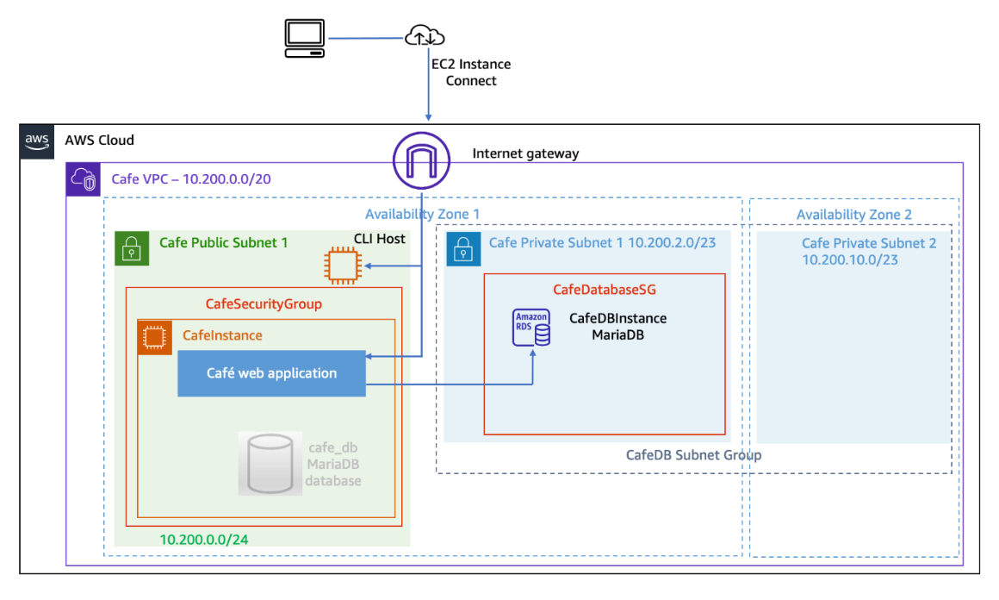

---

## 🧰 Serviços Utilizados e Justificativa

### Serviço AWS #1 Amazon RDS
- **Função:** Hospedar o banco de dados MariaDB de forma totalmente gerenciada, substituindo o banco local na instância EC2.

- **Por que foi escolhido:** O RDS simplifica o gerenciamento do banco de dados, fornecendo provisionamento, backups automáticos, atualizações de software e alta disponibilidade sem necessidade de administração manual.

- **Benefício principal:** Permite migrar dados existentes para um ambiente seguro, escalável e resiliente, garantindo continuidade da aplicação sem interrupções.

### Serviço AWS #2 Amazon EC2
- **Função:** Hospedar a aplicação web da cafeteria e servir como ponto de conexão para executar comandos da AWS CLI e realizar migração de dados.

- **Por que foi escolhido:** A EC2 permite executar o site da cafeteria e ferramentas de linha de comando (CLI) de forma flexível, sendo o ambiente inicial para a aplicação antes da migração.

- **Benefício principal:** Permite o controle total do ambiente da aplicação, além de servir como intermediário seguro para configurar e migrar o banco de dados para o RDS.

---

## 🪜 Passo a Passo 

> No final desse documento é possível encontrar todos os scripts usados, mas lembre de trocar as variáveis pelos valores do seu details do vocareum, ou pelos valores que forem sendo obtidos como outputs dos próprios comandos.

1. Confira os detalhes no vocareum:
	- Ele fornece dados importantes que serão usados durante a configuração dos recursos;

2. Criar uma instância de RDS por CLI:
	- Usamos ``EC2 instance connect`` para acessar a uma instância;
	- Configuramos as credenciais por meio do `aws configure`
		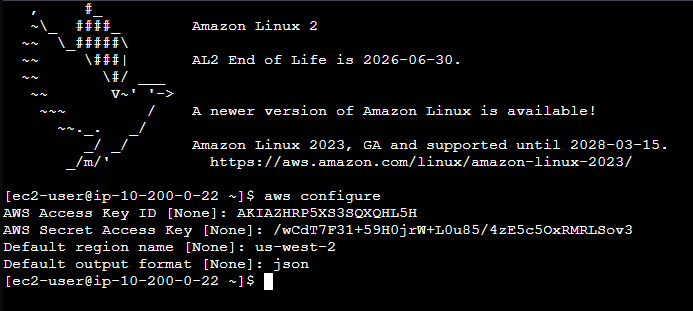

	- Criamos os componentes de rede necessários para o RDS:
	- Grupo de segurança:
		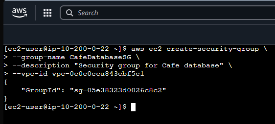
	
	- Cria regra de entrada nesse grupo de segurança:
		

	- Visualizar grupo com a regra aplicada
		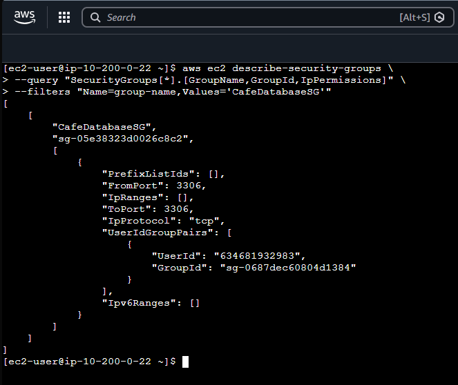

	- Criar as duas subnets 
		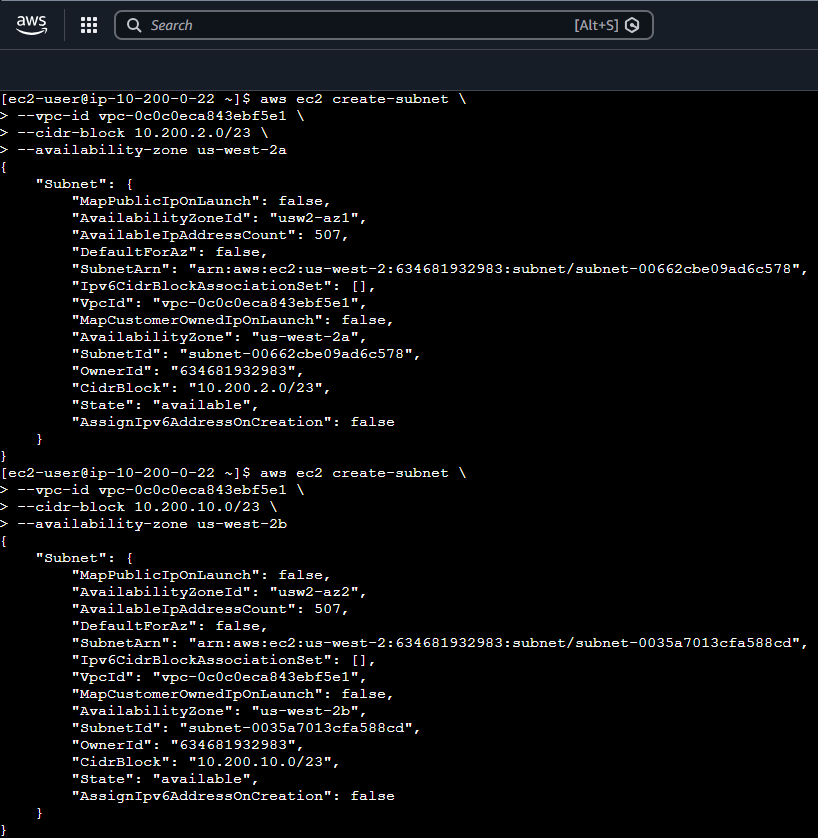

		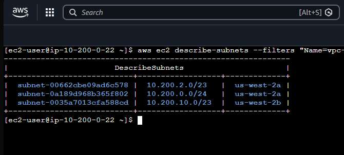


	- Criar o grupo de segurança para o CafeDB, usando as suas subnets criadas:
		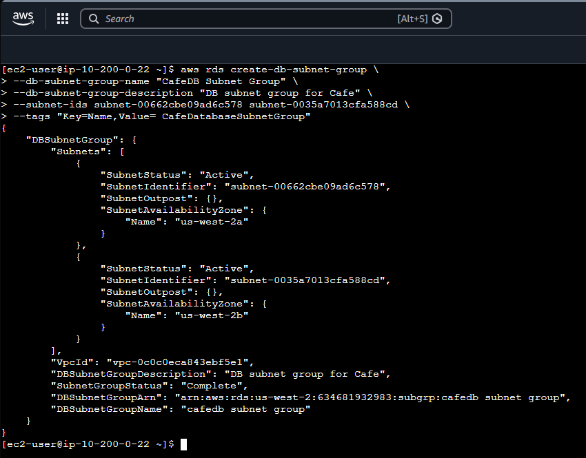
	
	-  Criar a instância RDS para Maria DB
		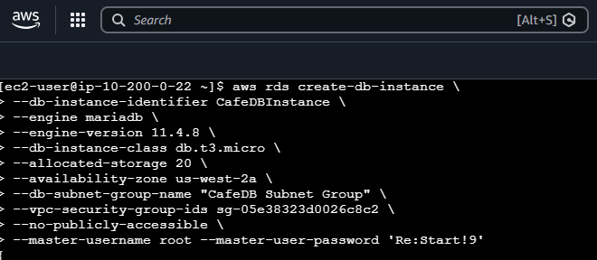


	- Conferir que a instância começou a ser criada:
		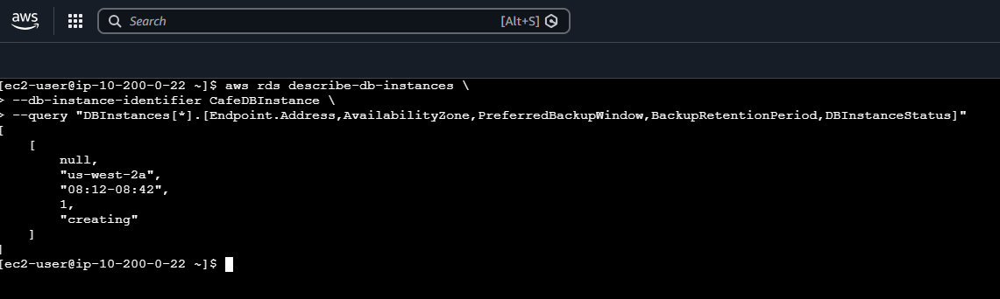


3. Migrar os dados da aplicação para a instância RDS:
	- Usar `EC2 instance connect` para conectar com a CafeInstance
	- Criar um backup do banco local
		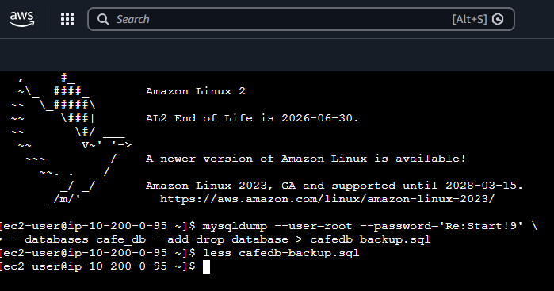

	- Restaurar esse backup na instância RDS que criamos:
		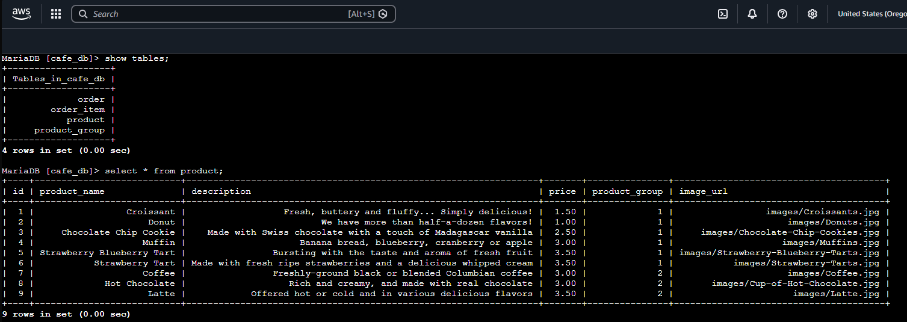

4. Configurar o site para usar a instância do RDS
	- Abrir o painel do Systems Manager
	- Ir até parameter store
	- No parâmetro `cafe/dbUrl` editar e adicionar o endpoint da instância RDS

---

## 🔐 Segurança

- **Sub-redes privadas:** O banco de dados do Amazon RDS é implantado em sub-redes privadas, isoladas da internet, evitando acesso direto externo.

- **Security Groups:** O acesso ao RDS é restrito apenas à instância EC2 da aplicação, garantindo que apenas a aplicação possa se conectar ao banco.

- **Credenciais seguras:** O usuário root do banco é configurado com senha forte, e a aplicação acessa o endpoint do RDS usando o Parameter Store do AWS Systems Manager, evitando exposição de credenciais no código.

- **Backups automáticos e snapshots:** O RDS realiza backups diários, protegendo os dados contra perda acidental.

- **Monitoramento e alertas:** Métricas do CloudWatch permitem detectar comportamentos anormais e responder rapidamente a problemas de desempenho ou segurança.


---

## 💰 Custos

- **Instância do Amazon RDS:** Tipo de instância (db.t3.micro no lab), armazenamento provisionado (20 GB) e horas de uso influenciam o valor.

- **Armazenamento:** O custo do armazenamento é baseado no tamanho alocado e na quantidade de IOPS provisionadas (se aplicável).

- **Transferência de dados:** Dados trafegando entre a EC2 e o RDS na mesma região têm custo reduzido ou nulo, mas transferências externas podem gerar custo adicional.

- **Serviços auxiliares:** Uso de Systems Manager Parameter Store e CloudWatch (para métricas e monitoramento) pode gerar custos pequenos dependendo da quantidade de parâmetros e métricas monitoradas.


---

## ⚙️ Scripts

- Criar grupo de segurança
```bash
aws ec2 create-security-group \
--group-name CafeDatabaseSG \
--description "Security group for Cafe database" \
--vpc-id <CafeInstance VPC ID>
```

-  Adicionar regra de entrada no grupo de segurança
```bash
aws ec2 authorize-security-group-ingress \
--group-id <CafeDatabaseSG Group ID> \
--protocol tcp --port 3306 \
--source-group <CafeSecurityGroup Group ID>
```

- Visualizar detalhes do grupo de segurança
```bash
aws ec2 describe-security-groups \
--query "SecurityGroups[*].[GroupName,GroupId,IpPermissions]" \
--filters "Name=group-name,Values='CafeDatabaseSG'"
```

- Criar subnets
```bash
aws ec2 create-subnet \
--vpc-id <CafeInstance VPC ID> \
--cidr-block 10.200.2.0/23 \
--availability-zone <CafeInstance Availability Zone>
```

- Criar grupo de subnets do cafedb
```bash
aws rds create-db-subnet-group \
--db-subnet-group-name "CafeDB Subnet Group" \
--db-subnet-group-description "DB subnet group for Cafe" \
--subnet-ids <Cafe Private Subnet 1 ID> <Cafe Private Subnet 2 ID> \
--tags "Key=Name,Value= CafeDatabaseSubnetGroup"
```

- Criar a instância RDS - MariaDB
```bash
aws rds create-db-instance \
--db-instance-identifier CafeDBInstance \
--engine mariadb \
--engine-version 10.5.13 \
--db-instance-class db.t3.micro \
--allocated-storage 20 \
--availability-zone <CafeInstance Availability Zone> \
--db-subnet-group-name "CafeDB Subnet Group" \
--vpc-security-group-ids <CafeDatabaseSG Group ID> \
--no-publicly-accessible \
--master-username root --master-user-password 'Re:Start!9'
```

- Para checar os status de criação e mais infos da instância
```bash
aws rds describe-db-instances \
--db-instance-identifier CafeDBInstance \
--query "DBInstances[*].[Endpoint.Address,AvailabilityZone,PreferredBackupWindow,BackupRetentionPeriod,DBInstanceStatus]"
```

- Na CafeInstance realizar o backup do banco
```bash
mysqldump --user=root --password='Re:Start!9' \
--databases cafe_db --add-drop-database > cafedb-backup.sql
```

- Restaurar o backup na instância RDS criada
```bash
mysql --user=root --password='Re:Start!9' \
--host=<RDS Instance Database Endpoint Address> \
< cafedb-backup.sql
```

- Conectar com a instância para fazer consultas no banco
```bash
mysql --user=root --password='Re:Start!9' \
--host=<RDS Instance Database Endpoint Address> \
cafe_db
```

- Alguns comandos que podem ser executados para verificar o banco, depois de conectado
```SQL
SHOW TABLES;
SELECT * FROM product;
```

