# 🧪 Dimensionar e balancear a carga da arquitetura

## 🔍 Visão Geral

- *Data:* 15/12/2025
- *Nome do Lab:* 174--Lab - Dimensionar e balancear a carga da arquitetura
- *Plataformas*: AWS re/start (Canvas) 
- *Serviços AWS:*  ELB, Auto Scaling, CloudWatch, EC2
- *Objetivo:*
	- Criar uma AMI de uma instância do EC2.
	- Criar um balanceador de carga.
	- Criar um modelo de execução e um grupo do Auto Scaling.
	- Configurar um grupo do Auto Scaling para dimensionar instâncias em sub-redes privadas.
	- Criar alarmes do Amazon CloudWatch para monitorar o desempenho da infraestrutura.

---

## 🧩 Problema a Ser Resolvido

- Em ambientes de produção, aplicações web precisam lidar com variações de tráfego ao longo do dia. Quando muitas pessoas acessam o site ao mesmo tempo, servidores isolados podem ficar sobrecarregados, causando lentidão ou indisponibilidade. Além disso, é necessário garantir que a aplicação continue funcionando mesmo se uma instância falhar.

- O problema é **como manter a aplicação disponível, escalável e resiliente**, distribuindo a carga entre múltiplas instâncias e ajustando automaticamente a capacidade do servidor conforme a demanda.

---

## 🏗️ Arquitetura da Solução

- A solução utiliza um **Application Load Balancer (ALB)** para distribuir o tráfego de usuários entre múltiplas instâncias do **EC2**, que estão organizadas em um **grupo do Auto Scaling**. As instâncias são iniciadas a partir de uma **AMI** personalizada, garantindo que todas tenham o mesmo conteúdo e configuração.

- O Auto Scaling ajusta automaticamente o número de instâncias conforme a demanda, mantendo a utilização média da CPU em torno de 50%, garantindo **alta disponibilidade, escalabilidade e tolerância a falhas**. O ALB está em sub-redes públicas, enquanto as instâncias do EC2 estão em sub-redes privadas distribuídas por duas Zonas de Disponibilidade, garantindo redundância.

---
### Diagrama de Arquitetura

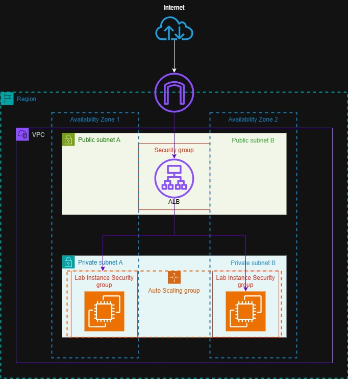

---

## 🧰 Serviços Utilizados e Justificativa

### ==Serviço AWS #1 - Elastic Load Balancer (Nesse caso, o ALB)==
- **Função:** Distribuir o tráfego de entrada entre múltiplas instâncias do EC2, garantindo que nenhuma fique sobrecarregada.

- **Por que foi escolhido:** Permite alta disponibilidade e tolerância a falhas, enviando requisições apenas para instâncias saudáveis.

- **Benefício principal:** Garante que a aplicação continue responsiva e disponível mesmo durante picos de tráfego ou falhas em algumas instâncias.

### ==Serviço AWS #2 - Auto Scaling==
- **Função:** Ajustar automaticamente o número de instâncias do EC2 conforme a demanda da aplicação.

- **Por que foi escolhido:** Facilita a escalabilidade da aplicação sem intervenção manual, aumentando instâncias em picos de carga e reduzindo em períodos ociosos.

- **Benefício principal:** Mantém a performance da aplicação estável e otimiza custos, garantindo que a infraestrutura seja usada de forma eficiente.
---

## 🪜 Passo a Passo 

1. Criar a AMI para o Auto Scaling
	- Acessei a instância do Web Server e criei uma AMI a partir dela
		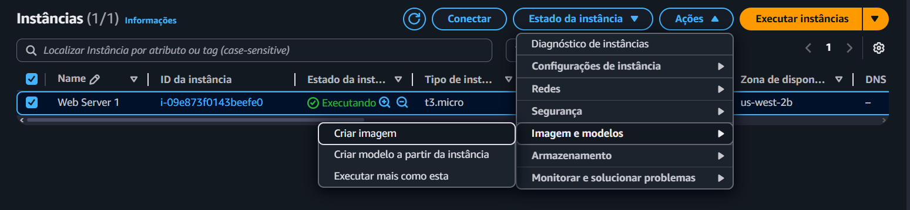

2. Criar o Load Balancer
	- Acessei o painel de criação de load balancers e criei um para tráfego entre instâncias
		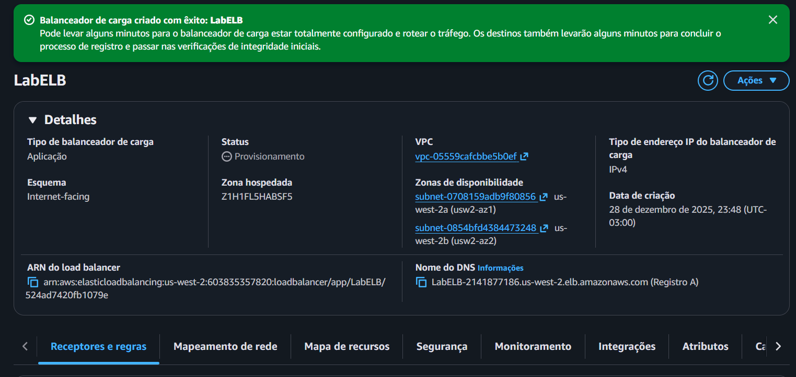

3. Criar um modelo de execução
	- Foi criado um modelo de execução para o grupo de auto scaling com a AMI gerada
		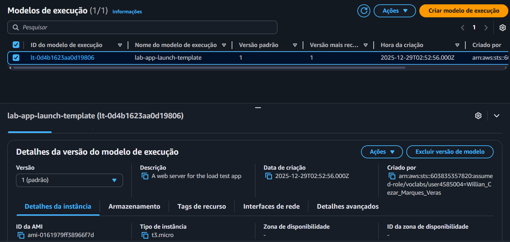

4. Criar um grupo de Auto Scaling
	- Definir o modelo e configuração
	- Definir opções de execução
	- Definir integração com outros serviços
	- Definir tamanho do grupo e ajuste de escala
		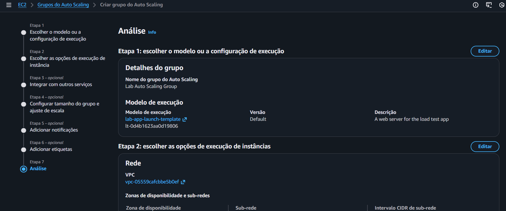

5. Conferindo alterações:
	- Agora temos as duas instâncias mínimas de `lab instance` como configuramos
		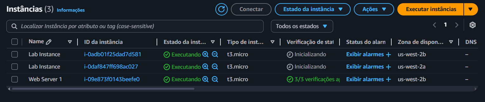

		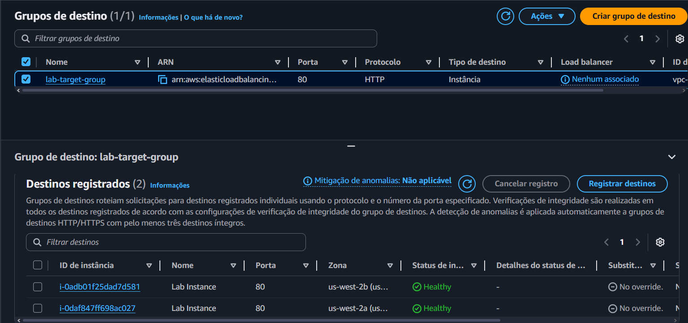

	- Conferindo a criação dos alarmes no CloudWatch
		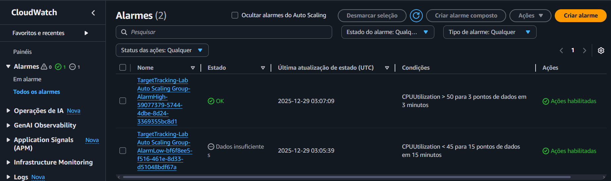

6.  Testar
	- Abrir a aplicação web no navegador e realizar os teste de estresse na EC2

		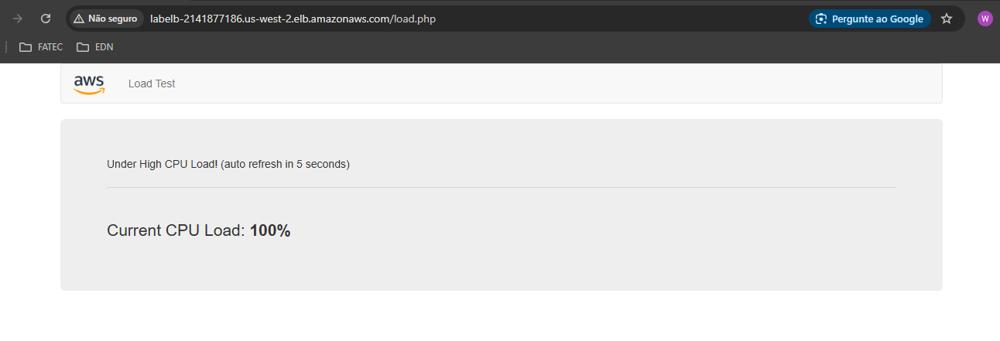

	- Antes de testar, o alarme low fica em alerta para subir o mínimo de EC2 configuradas
		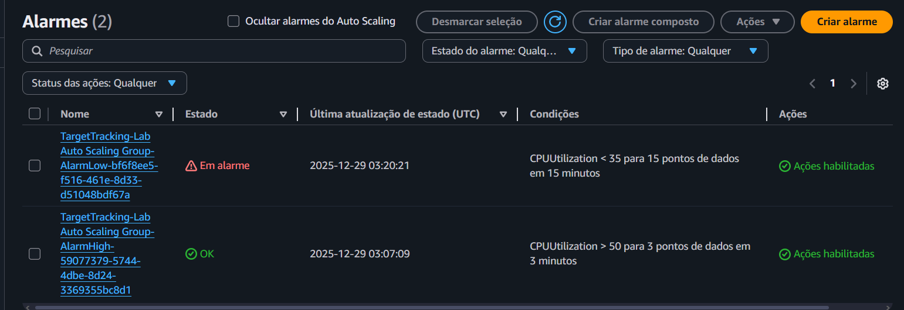

	- Depois de testar, o alarme high fica em alerta, pois atingiu o a métrica configurada
		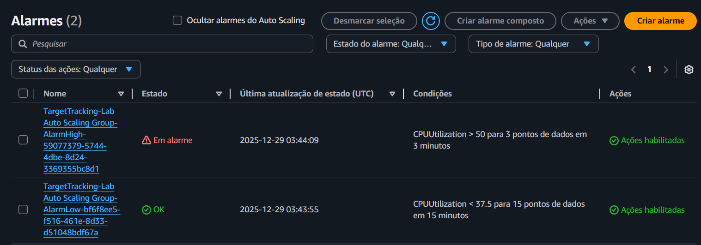

	- Com isso, atinge o máximo das 4 instâncias configuradas automaticamente para atender a demanda do problemas que precisava ser resolvido
		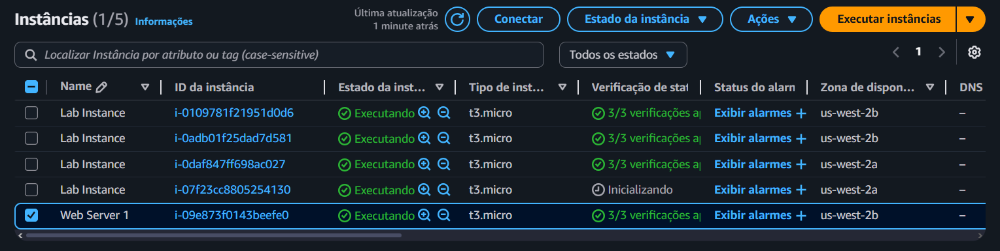

---

## 🔐 Segurança

- As instâncias do EC2 estão em **sub-redes privadas**, protegendo-as de acessos diretos pela internet.

- O **grupo de segurança da web** permite apenas tráfego HTTP para o ALB, restringindo o acesso às instâncias privadas.

- O **ALB realiza health checks** e só envia tráfego para instâncias saudáveis, prevenindo acesso a recursos não confiáveis.

---

## 💰 Custos

- O custo principal é gerado pelas instâncias do **EC2**, que variam conforme o tipo, quantidade e tempo de execução.

- O **ALB** gera custo por hora e por quantidade de tráfego processado.

- O Auto Scaling ajuda a **otimizar custos**, aumentando instâncias somente quando necessário e reduzindo durante períodos de baixa demanda.

---
