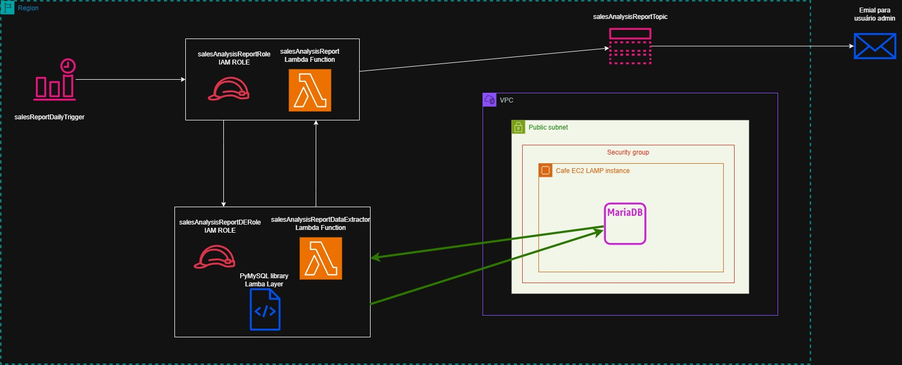
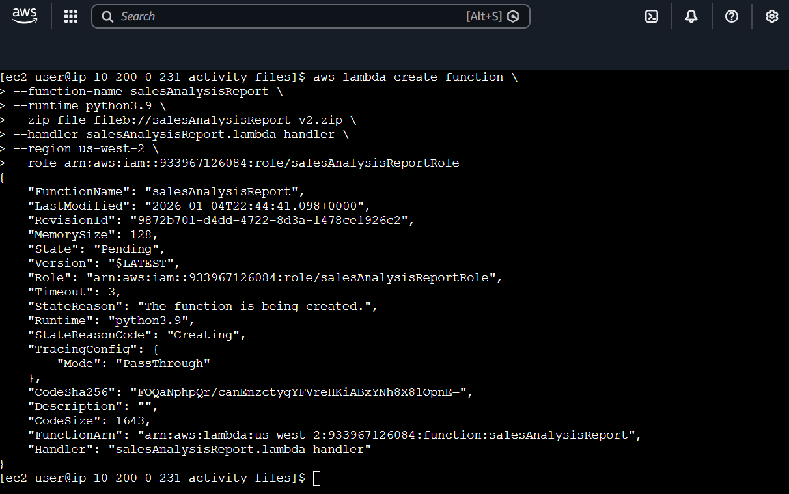
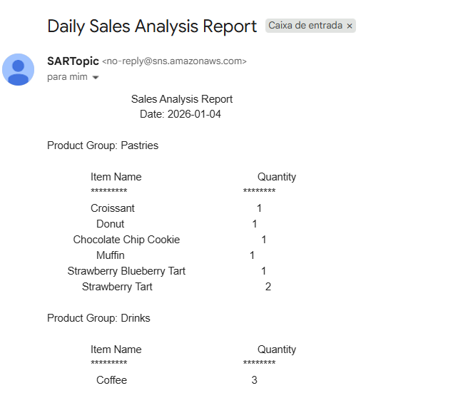
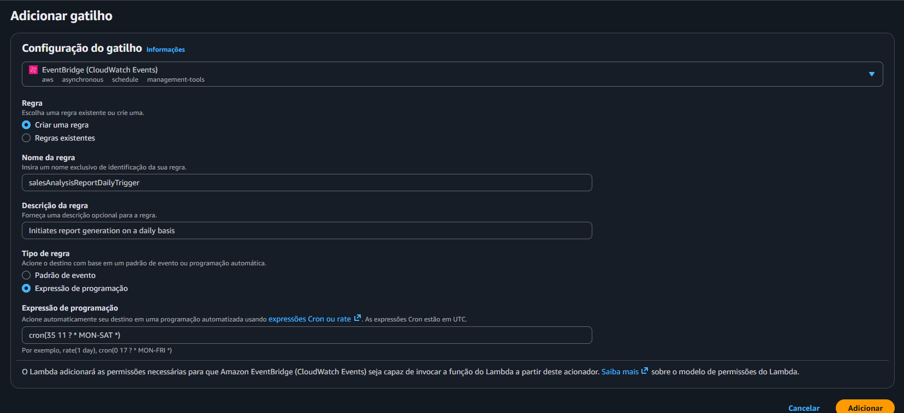

# 🧪 Trabalhar com o AWS Lambda

## 🔍 Visão Geral

- *Data:* 17/12/2025
- *Nome do Lab:* 178--Lab - Trabalhar com o AWS Lambda
- *Plataformas*: AWS re/start (Canvas) 
- *Serviços AWS:*  Lambda, CloudWatch, SNS, IAM, Systems Manager Parameter Store
- *Objetivo:*
	- Reconhecer as permissões necessárias da política do AWS Identity and Access Management (IAM) para viabilizar uma função do Lambda para outros recursos da Amazon Web Services (AWS).
	
	- Criar uma camada do Lambda para satisfazer uma dependência de biblioteca externa.
	
	- Criar funções do Lambda que extraiam dados do banco de dados e enviar relatórios ao usuário.
	
	- Implantar e testar uma função do Lambda que é iniciada com base em uma programação e que invoca outra função.
	
	- Usar o CloudWatch Logs para solucionar problemas ao executar uma função do Lambda.

---
## 🧩 Problema a Ser Resolvido

Uma cafeteria precisa gerar **relatórios diários de análise de vendas** para o administrador, mostrando quais produtos foram vendidos e em qual quantidade.  
Os dados de vendas estão armazenados em um **banco de dados MySQL** que roda em uma instância **EC2 (LAMP)**.

O processo deve:
- Rodar **automaticamente todos os dias**, sem intervenção manual
- Não exigir servidores dedicados para processamento do relatório
- Ser **escalável, confiável e de baixo custo**
- Enviar o relatório final **por e-mail**

O desafio é criar essa automação usando **computação sem servidor**, integrando banco de dados, agendamento e notificações, com segurança adequada.

---

## 🏗️ Arquitetura da Solução

### Descrição da Arquitetura

- Um **evento agendado do Amazon EventBridge (CloudWatch Events)** dispara diariamente a função **AWS Lambda `salesAnalysisReport`**.

- A função `salesAnalysisReport`:
    - Lê as credenciais do banco de dados no **AWS Systems Manager Parameter Store**
    - Invoca outra função Lambda chamada **`salesAnalysisReportDataExtractor`**

- A função `salesAnalysisReportDataExtractor`:
    - Conecta-se ao **banco de dados MySQL** que roda em uma EC2 dentro de uma VPC
    - Executa uma consulta analítica para extrair os dados de vendas

- Os dados retornam para a função `salesAnalysisReport`

- A função principal:
    - Formata os dados em um relatório
    - Publica a mensagem em um **tópico do Amazon SNS**

- O **Amazon SNS** envia o relatório final **por e-mail** ao administrador
---
### Diagrama de Arquitetura

---
## 🧰 Serviços Utilizados e Justificativa

### Serviço AWS #1 AWS Lambda
- **Função:**  
    Executar o processamento do relatório de vendas, incluindo extração de dados do banco MySQL e envio do relatório.

- **Por que foi escolhido:**  
    Permite executar código sob demanda e de forma agendada, sem a necessidade de gerenciar servidores.

- **Benefício principal:**  
    **Computação serverless**, com **escala automática**, **alta disponibilidade** e **pagamento apenas pelo uso**.
### Serviço AWS #2 Amazon EventBridge (CloudWatch Events)
- **Função:**  
    Agendar a execução diária da função Lambda usando uma expressão Cron.

- **Por que foi escolhido:**  
    É o serviço nativo da AWS para **eventos e agendamentos** que disparam funções Lambda automaticamente.

- **Benefício principal:**  
    **Automação baseada em tempo**, sem necessidade de scripts ou servidores de agendamento.
### Serviço AWS #3 Amazon SNS
- **Função:**  
    Enviar o relatório de análise de vendas por e-mail ao administrador.

- **Por que foi escolhido:**  
    Permite distribuir mensagens para múltiplos assinantes de forma simples e confiável.

- **Benefício principal:**  
    **Entrega desacoplada de notificações**, com suporte a vários protocolos (e-mail, SMS, HTTP).
### Serviço AWS #4 AWS Systems Manager Parameter Store
- **Função:**  
    Armazenar de forma segura as informações de conexão do banco de dados (URL, usuário, senha).

- **Por que foi escolhido:**  
    Evita credenciais hardcoded no código da função Lambda.
    
- **Benefício principal:**  
    **Segurança e centralização de configurações**, com controle de acesso via IAM.

### Serviço AWS #4 AWS IAM
- **Função:**  
    Controlar as permissões das funções Lambda para acessar SNS, Parameter Store, CloudWatch e outras funções Lambda.

- **Por que foi escolhido:**  
    Toda função Lambda precisa de uma **IAM Role** para acessar outros serviços da AWS.

- **Benefício principal:**  
    **Segurança baseada em permissões**, seguindo o **princípio do menor privilégio**.

---
## 🪜 Passo a Passo

1. Observar as ROLES IAM:
	- O lab disponibiliza a roles para que cada uma das funções lambda acessem os recursos necessários apenas;

2. Criar uma camada com bibliotecas necessárias para execução das funções:
	- Adicionamos código que todas funções lambda podem reutilizar

3. Criar a função lambda que vai extrair os dados do DB da EC2:
	- Criamos a função lambda;
	- Adicionamos a camada criadas anteriormente a função;
	- Importamos o código que será executado pela função;
	- Configuramos a rede em que a função ira se conectar;

4. Acessar o painel de gerenciador de parâmetros:
	- Vamos encontrar todas os parâmetros necessários para passar ao evento de teste que vai acionar a função lambda;

5. Problemas com regras de segurança:
	- Como nossa função será usada para acessar um banco de dados MySQL, extrair e analisar dados, precisamos garantir que a EC2 que ela vai acessar na VPC tenha liberado a entrada na porta 3306 (porta padrão do MySQL)

6. Testar a função que irá extrair os dados:
	- Acessamos a página web da instância que está conectada ao banco;
	- Realizamos operações que adicionam dados ao banco;
	- Ao rodar o evento de teste, ele já captura esses dados;

7. Configurar as notificações:
	- Acessamos o o serviço SNS;
	- Criamos um tópico;
	- Criamos uma assinatura, adicionando um email relacionado ao tópico;
	- Confirmamos a assinatura na caixa de email;

8. Criar função lambda para gerar os relatórios:
	- Dessa vez vamos criar a função não pelo, console, mas pela AWS CLI
		
	- Adicionamos uma variável de ambiente nas configurações dessa função depois de criar
	- Ao rodar o evento de teste, já podemos conferir no email:
		

9.  Criar o gatilho que vai disparar o envio do report:
	

---

## 🔐 Segurança

- **IAM Roles para Lambda**:  
    Cada função Lambda usa uma **role específica**, permitindo acesso apenas aos serviços necessários (SNS, Parameter Store, CloudWatch), seguindo o **princípio do menor privilégio**.

- **Credenciais protegidas no Parameter Store**:  
    Informações sensíveis do banco de dados (usuário e senha) não ficam no código, mas armazenadas de forma segura no **AWS Systems Manager Parameter Store**.

- **Isolamento de rede com VPC**:  
    A função Lambda que acessa o banco de dados roda dentro de uma **VPC**, usando **sub-rede e grupo de segurança**, limitando o acesso à instância EC2 apenas pela porta necessária (3306).

---

## 💰 Custos

- **AWS Lambda**:  
    Cobrado com base no **número de execuções** e no **tempo de execução** da função. Como o relatório roda apenas uma vez por dia, o custo é muito baixo.

- **Amazon SNS**:  
    Custo por **mensagem publicada e entregue**. O envio de e-mails gera custo mínimo nesse cenário.

- **Amazon EventBridge (CloudWatch Events)**:  
    Cobrança baseada no número de **eventos gerados**, geralmente irrelevante para execuções diárias.

---